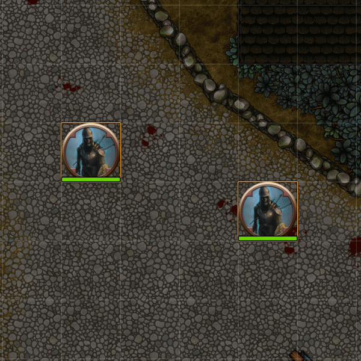

# Sequencer

This module implements a basic pipeline that can be used for managing the flow of a set of functions, effects, sounds, and macros.

## Credits
Sequencer stands on the shoulder of giants:

* U-man over at [FXMaster](https://gitlab.com/mesfoliesludiques/foundryvtt-fxmaster) - Copyright © 2020 Emmanuel Ruaud
* Otigon with his [Automated Animations](https://github.com/otigon/automated-jb2a-animations) - Copyright © 2020 Otigon
* [Easing Functions Cheat Sheet](https://easings.net/) ([GitHub](https://github.com/ai/easings.net)) - Copyright © 2020 Andrey Sitnik and Ivan Solovev

## Effects shown in this readme
* [JB2A - Jules&Ben's Animated Assets](https://foundryvtt.com/packages/JB2A_DnD5e) (Full paid version [here](https://www.jb2a.com/))
* [Jack Kerouac's Animated Spell Effects](https://foundryvtt.com/packages/animated-spell-effects)
* [Jack Kerouac's Animated Cartoon Spell Effets](https://foundryvtt.com/packages/animated-spell-effects-cartoon)

## Download here:
`https://github.com/Haxxer/FoundryVTT-Sequencer/releases/latest/download/module.json`

##  [Documentation](DOCS.md) 
Click the link above to go to the documentation where each feature is listed.

## How to use

First you have to define a sequence:

```js
let sequence = new Sequence()
```

Then, you can add functions and effects to it.

```js
let sequence = new Sequence()

sequence.thenDo(function(){
    do_something();
})

sequence.wait(200)

sequence.thenDo(async function(){
    do_something_else();
})
```

The Sequencer uses a method-chaining fluent interface, meaning you can continuously call functions on the sequence object, like so:

```js
let sequence = new Sequence()
    .thenDo(function(){
        do_something();
    })
    .wait(200)
    .thenDo(async function(){
        do_something_else();
    })
```

To start the sequence off, you simply call `play()` on the sequence.

[⬇️ Go to advanced examples ⬇️](https://github.com/Haxxer/FoundryVTT-Sequencer#advanced-examples)

## Usage Example

To get the following result:

* Plays an effect on a token's location
* Wait for 400 milliseconds
* Play a sound
* Wait for 600 milliseconds
* Play another effect pointing towards 500px to the left of the token
* Wait for 100 milliseconds
* Teleport the token 500px to the left
* Play another effect on the token's location


You'd have to write something like this:

```js
async function wait(ms){
    return new Promise(resolve => {
        setTimeout(resolve, ms);
    });
}

const token = canvas.tokens.controlled[0];

let data = {
    file: "modules/animated-spell-effects-cartoon/spell-effects/cartoon/electricity/electrivity_blast_CIRCLE.webm",
    position: token.center,
    anchor: {
        x: 0.5,
        y: 0.5
    },
    scale: {
        x: 0.35,
        y: 0.35
    }
};

game.socket.emit("module.fxmaster", data);
canvas.fxmaster.playVideo(data);

await wait(400);

AudioHelper.play({
    src: ["Music/Sound_Effects/teleport.wav"],
    volume: 0.8,
    autoplay: true,
    loop: false
}, true);

await wait(600);

let to_location = {
    x: token.center.x-500,
    y: token.center.y
}

let ray = new Ray(token.center, this._to);

data = {
    file: "modules/animated-spell-effects-cartoon/spell-effects/cartoon/electricity/lightning_bolt_RECTANGLE_05.webm",
    position: token.center,
    anchor: {
        x: 0.5,
        y: 0.5
    },
    scale: {
        x: 0.2,
        y: 0.2
    },
    rotation: ray.angle,
    width: ray.distance
};

game.socket.emit("module.fxmaster", data);
canvas.fxmaster.playVideo(data);

await wait(100);

await token.update({ x: token.position.x-500, y: token.position.y }, { animate: false });

data = {
    file: "modules/animated-spell-effects-cartoon/spell-effects/cartoon/electricity/electric_ball_CIRCLE_06.webm",
    position: token.center,
    anchor: {
        x: 0.5,
        y: 0.5
    },
    scale: {
        x: 0.5,
        y: 0.5
    }
};

game.socket.emit("module.fxmaster", data);
canvas.fxmaster.playVideo(data);
```

Here's an example using the Sequencer instead:

```js
let tokenD = canvas.tokens.controlled[0];
let sequence = new Sequence()
    .effect()
        .file("modules/animated-spell-effects-cartoon/spell-effects/cartoon/electricity/electrivity_blast_CIRCLE.webm")
        .atLocation(tokenD)
        .scale(0.35)
    .wait(400)
    .sound("Music/Sound_Effects/teleport.wav")
    .wait(600)
    .effect()
        .file("modules/animated-spell-effects-cartoon/spell-effects/cartoon/electricity/lightning_bolt_RECTANGLE_05.webm")
        .atLocation(tokenD)
        .reachTowards({
            x: tokenD.center.x-500,
            y: tokenD.center.y
        })
    .wait(100)
    .thenDo(function(){
        token.update({ x: token.position.x-500, y: token.position.y }, { animate: false });
    })
    .effect()
        .file("modules/animated-spell-effects-cartoon/spell-effects/cartoon/electricity/electric_ball_CIRCLE_06.webm")
        .atLocation(tokenD)
        .scale(0.5)

sequence.play();
```

*Uses [Jack Kerouac's Animated Cartoon Spell Effets](https://foundryvtt.com/packages/animated-spell-effects-cartoon)*

# Advanced examples

## Magic Missile


```js
new Sequence()
    .effect()
        .atLocation(canvas.tokens.controlled[0])
        .reachTowards(canvas.tokens.controlled[1])
        .startPoint(200)
        .endPoint(200)
        .repeats(3, 200, 300)
        .baseFolder("Images/Effects/Magic_Missile")
        .setMustache({
            "color": () => {
                return ['Blue', 'Green', 'Purple', 'Yellow'][Math.floor(Math.random() * 4)]
            },
            "number": () => {
                return Math.floor(Math.random() * 9) + 1;
            }
        })
        .addOverride(
            async (effect, data) => {
                if(data._distance <= 1800){
                    data.file = "MagicMissile_01_Regular_{{color}}_30ft_0{{number}}_1600x400.webm";
                }else{
                    data.file = "MagicMissile_01_Regular_{{color}}_60ft_0{{number}}_2800x400.webm";
                }
                return data
            }
        )
    .play();
```

*Uses [JB2A - Jules&Ben's Animated Assets](https://foundryvtt.com/packages/JB2A_DnD5e)*

## Magic Circle


```js
new Sequence()
    .effect()
        .file("modules/jb2a_patreon/Library/Generic/Magic_Signs/Abjuration_01_Blue_Circle_800x800.webm")
        .atLocation(canvas.tokens.controlled[0])
        .JB2A()
        .scale(0.25)
        .belowTokens()
        .fadeIn(1500, {ease: "easeOutCubic", delay: 500})
        .fadeOut(1500)
        .rotateIn(90, 2500, {ease: "easeInOutCubic"})
        .rotateOut(350, 1500, {ease: "easeInCubic"})
        .scaleIn(0.5, 2500, {ease: "easeInOutCubic"})
        .scaleOut(0, 1500, {ease: "easeInCubic"})
    .play()
```

*Uses [JB2A - Jules&Ben's Animated Assets](https://foundryvtt.com/packages/JB2A_DnD5e)*

## Lightning Strike


```js
new Sequence()
    .effect()
        .atLocation(canvas.tokens.controlled[0])
        .file('Images/Effects/Lightning/LightningStrike_01{{letter}}_800x800.webm')
        .setMustache({
            // random letter between a to f
            "letter": String.fromCharCode(Math.floor(Math.random()*6)+1+64).toLowerCase()
        })
        .scale(2)
        .randomizeMirrorX()
    .play();
```

*Uses [JB2A - Jules&Ben's Animated Assets](https://foundryvtt.com/packages/JB2A_DnD5e)*

## Acid Splash



```js
new Sequence()
    .effect("modules/animated-spell-effects-cartoon/spell-effects/cartoon/water/acid_splash_CIRCLE_01.webm")
        .atLocation(canvas.tokens.controlled[0])
        .scale(0.3, 0.6)
        .randomRotation()
    .effect("modules/animated-spell-effects-cartoon/spell-effects/cartoon/water/acid_splash_CIRCLE_01.webm")
        .atLocation(canvas.tokens.controlled[1])
        .scale(0.3, 0.6)
        .randomRotation()
    .play();
```

*Uses [Jack Kerouac's Animated Cartoon Spell Effets](https://foundryvtt.com/packages/animated-spell-effects-cartoon)*

## Changelog

### Version 0.4.3 Minor Fixes
- *Effects* - Removed error catch in `.file()` when providing it with something else than string or array
- *Effects* - Fixed `.belowTokens()` and `.belowTiles()` throwing errors if no boolean was provided

### Version 0.4.2 Hotfix
- *Effects* - Added `.rotate()` which adds an offset to the effect's rotation
- *Effects* - Fixed `.moveTowards()` not respecting given easing

### Version 0.4.1
- *Sequencer* -  **Breaking Changes**: Removed deprecated `.then()` method 
- *Sequencer* - Tweaked `.play()` to now return a promise
- *Sequencer* - Reworked module class structure
- *Sequencer* - Added debug setting


### Version 0.4.0
- *Sequencer* - Renamed `.then()` to `.thenDo()` due to JavaScript reasons —  `.then()` will be removed in 0.4.1 
- *Sequencer* - Removed the requirement to pass `true` as a second argument to `.then()` (now `.thenDo()`) if the function was async, it will now wait for it to finish if it is an `async function`
- *Effects* - Added `.mirrorX()` and `.mirrorY()` to mirror the effect on that axis
- *Effects* - Improved `.JB2A()` to better handle melee weapon attacks
- *Effects* - Tweaked `.belowTiles()` and `.belowTokens()` to accept an optional boolean parameter whether the effect should play behind the respective element
- *Effects* - Tweaked effects to assume that .webms have a base 100px internal grid for size consistency

### Version 0.3.13 Hotfix
- *Effects* - Fixed ANOTHER bug with `.belowTiles()` sometimes not playing below tiles

### Version 0.3.12
- *Effects* - Added `.opacity()` which controls the alpha of the effect being played
- *Effects* - Fixed bug with `.belowTiles()` sometimes not playing below tiles

### Version 0.3.11
- *Effects* - Added `.belowTiles()` to play effects below tiles
- *Effects* - Implemented better order handling - the effects created first will always be on top, each subsequent effect will be played below the previous
- *Effects* - Added `.zIndex()` for you to have direct control over the order of effects
- *Effects & Sounds* - Added `.duration()` which can override the duration of an effect or sound
- *Effects & Sounds* - Tweaked `.waitUntilFinished()` to accept a single number parameter as a delay or to end the effect or sound earlier - read more in the [documentation](DOCS.md#wait-until-finished)
- *Sounds* - Added support for `.fadeIn()` and `.fadeOut()` - easing sadly doesn't work for sounds yet

### Version 0.3.10
- *Sequencer* - Added macro pack containing examples of Sequencer usages
- *Effects* - Added the following animated functions:
  - `.scaleIn()`
  - `.scaleOut()`
  - `.rotateIn()`
  - `.rotateOut()`
  - All of these can utilize any of the easings listed here: https://easings.net/
  - Read the [documentation](DOCS.md#scale-in) how to use these
- *Effects* - Added better error reporting when something goes wrong in the sequence
- *Effects* - Fixed bug with scale sometimes overriding `.reachTowards()`

### Version 0.3.9
- *Effects* - Added `.belowTokens()` so you can now play effects, well, below tokens  
- *Effects* - Fixed effects not replicating properly (AGAIN)
- *Effects* - Fixed effects not being able to use `.name()`d effects if they didn't miss - now any effect can be named and be used in future effects

### Version 0.3.8 Hotfix
- *Effects* - Fixed effects that were supposed to be once-off instead looping  

### Version 0.3.7
- *Effects* - Added `.moveTowards()` and `.moveSpeed()` for missile-like behavior
- *Effects* - Tweaked the way the effects layer is applied to the canvas' layers
- *Effects* - Fixed major issue with the way effects that were using `.missed()` and `.name()` were cached
- *Sequencer* - Removed stray debug code

### Version 0.3.6
- *Effects* - Added `.fadeIn()` and `.fadeOut()` - you can now make your effects look slightly nicer!
- *Effects* - Added support for cone and line templates with `.reachTowards()` and `.rotateTowards()` - it now reaches towards the end point of the template
- *Effects* - Added `.name()` to effects - this will cause the effect's position to be stored and can then be used with `.atLocation()`, `.reachTowards()`, and `.rotateTowards()` to refer to previous effects' locations
    - Example: naming an impact effect with `.name("hit_location")` and making it miss with `.missed()`, and then have a subsequent effect use `.rotateTowards("hit_location")` to rotate towards the previous effect's calculated location
- *Effects* - Fixed `.scale()` bug that caused it to not properly set the scale and then cause an error upon calling `.play()`
- *Effects* - Removed `.moves()` for future implementation
- *Sequencer* - Tweaked `.async()` and `.waitUntilFinished()` handling
    - They now act the same on effect and sounds that only play once, but if it `.repeats()`, `.async()` causes the effect or sound to wait between each repetition, `.waitUntilFinished()` causes the sequencer to wait until the effect or sound has finished executing all of its repetitions, which may or may not wait for each effect or sound to play with `.async()`
- *Sequencer* - Calling `.play()` now returns the sequence
- *Sequencer* - Removed `FXMaster` dependency and implemented a custom canvas layer and effects class 

### Version 0.3.5 Hotfix
- *Sequencer* - Fixed `.wait()` breaking due to the `.async()` and `.waitUntilFinished()` swap

### Version 0.3.4 Hotfix
- *Effects* - Fixed issue that caused the wrong scale to be applied when using `.reachTowards()`

### Version 0.3.3
- *Effects* - Added `.playIf()` ([docs](DOCS.md#play-if)); this allows you to completely ignore playing an effect or sound, depending on a boolean or a function
- *Sounds* - Added support for `.async()` and `.waitUntilFinished()` for sounds - requires both to be `true` due to code weirdness, I'll be refactoring this in the future
- *Effects* - Refactored `.scale()` when it was provided with a minimum and maximum value, it now randomizes the scale of the effect when executed instead of when the method was called
- *Effects & Sounds* - Refactored `.file()` for both effects and sounds so that providing an array of files no longer immediately picks one from the array, but randomly picks a file each time the section is executed
- *Effects & Sounds* - Refactored how `.delay()` interacted with `.repeats()`, which should result in more consistent behavior
- *Sequencer* - Swapped the functionality of `.async()` and `.waitUntilFinished()`, and clarified in the docs
- *Sequencer* - Added support for random range within a `.wait()` block (like, `.wait(500, 1000)` etc)

### Version 0.3.2 - 0.8.x ready!
* *Effects* - Added `.playbackRate()` to effects, you can now speed up the play rate of your effects
* *Sequencer* - Tweaked internal handling of `.async()` together with `.waitUntilFinished()` improved
* *Sequencer* - Tweaked to use `ready` instead of `init` to load module

### Version 0.3.1
- *Effects* - Refactored `.randomizeMirror()` into `.randomizeMirrorX()` and `.randomizeMirrorY()`
- *Effects* - Refactored scaling algorithm for `.reachTowards()`
- *Sequencer* - Added support for random `.wait()` interval 

### Version 0.3.0
- *Effects* - Refactored `.aimTowards()` into `.rotateTowards()` and `.reachTowards()`
- *Effects* - Refactored how `.missed()` chooses the location to hit and now takes token size into account
- *Effects* - Added `.JB2A()` to automatically set the effect to handle their sprites in the best way possible
- *Effects* - Added `.randomizeMirror()` to randomly mirror sprites on the Y axis
- *Effects* - Added Mustache support in file names

### Version 0.2.0
- *Sequencer* - Added support for executing macros
- *Sequencer* - Added support for playing sounds
- *Sequencer* - Wrapped classes in proxies to simplify fluid interface (gets rid of `.done()` on effects and sounds)

### Version 0.1.0
- First implementation
