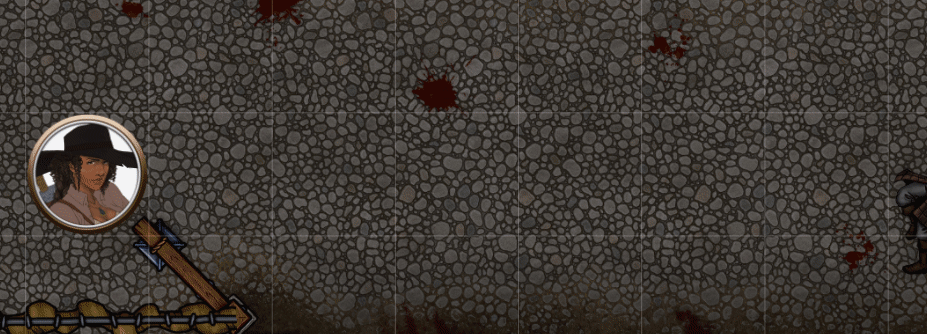
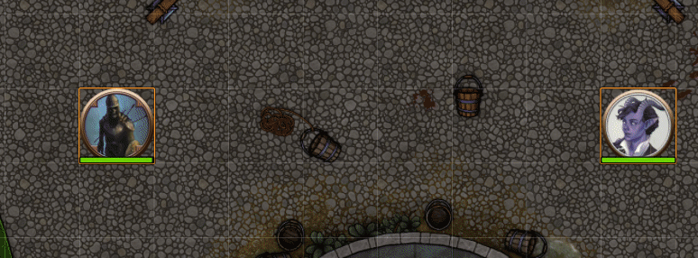

# Sequencer

This module implements a basic pipeline that can be used for managing the flow of a set of functions, effects, sounds, and macros.

## Effects shown in this readme
* [JB2A - Jules&Ben's Animated Assets](https://foundryvtt.com/packages/JB2A_DnD5e) (Full paid version [here](https://www.patreon.com/JB2A))
* [Jack Kerouac's Animated Spell Effects](https://foundryvtt.com/packages/animated-spell-effects)
* [Jack Kerouac's Animated Cartoon Spell Effets](https://foundryvtt.com/packages/animated-spell-effects-cartoon)

## Download here:
[https://github.com/FantasyCalendar/FoundryVTT-Sequencer/releases/latest/download/module.json](https://github.com/FantasyCalendar/FoundryVTT-Sequencer/releases/latest/download/module.json)

##  [Documentation & Guides](https://github.com/fantasycalendar/FoundryVTT-Sequencer/wiki) 
Click the link above to go to the documentation where each feature is listed.

## How to use
First you have to define a sequence:

```js
let sequence = new Sequence()
```

Then, you can add functions and effects to it.

```js
let sequence = new Sequence()

sequence.thenDo(function(){
    do_something();
})

sequence.wait(200)

sequence.thenDo(async function(){
    do_something_else();
})
```

The Sequencer uses a method-chaining fluent interface, meaning you can continuously call functions on the sequence object, like so:

```js
let sequence = new Sequence()
    .thenDo(function(){
        do_something();
    })
    .wait(200)
    .thenDo(async function(){
        do_something_else();
    })
```

To start the sequence off, you simply call `play()` on the sequence.

[⬇️ Go to advanced examples ⬇️](https://github.com/Haxxer/FoundryVTT-Sequencer#advanced-examples)

## Usage Example

### This example uses [Jack Kerouac's Animated Cartoon Spell Effets](https://foundryvtt.com/packages/animated-spell-effects-cartoon)

To get the following result:

* Plays an effect on a token's location
* Wait for 400 milliseconds
* Play a sound
* Wait for 600 milliseconds
* Play another effect pointing towards 500px to the left of the token
* Wait for 100 milliseconds
* Teleport the token 500px to the left
* Play another effect on the token's location


You'd have to write something like this (with FXMaster installed):

```js
async function wait(ms) {
    return new Promise(resolve => {
        setTimeout(resolve, ms);
    });
}

const token = canvas.tokens.controlled[0];

let data = {
    file: "modules/animated-spell-effects-cartoon/spell-effects/cartoon/electricity/electrivity_blast_CIRCLE.webm",
    position: token.center,
    anchor: {
        x: 0.5,
        y: 0.5
    },
    scale: {
        x: 0.35,
        y: 0.35
    }
};

game.socket.emit("module.fxmaster", data);
canvas.fxmaster.playVideo(data);

await wait(400);

AudioHelper.play({
    src: ["Music/Sound_Effects/teleport.wav"],
    volume: 0.8,
    autoplay: true,
    loop: false
}, true);

await wait(600);

let to_location = {
    x: token.center.x + canvas.grid.size*4,
    y: token.center.y
}

let ray = new Ray(token.center, this._target);

data = {
    file: "modules/animated-spell-effects-cartoon/spell-effects/cartoon/electricity/lightning_bolt_RECTANGLE_05.webm",
    position: token.center,
    anchor: {
        x: 0.5,
        y: 0.5
    },
    scale: {
        x: 0.2,
        y: 0.2
    },
    rotation: ray.angle,
    width: ray.distance
};

game.socket.emit("module.fxmaster", data);
canvas.fxmaster.playVideo(data);

await wait(100);

await token.update({ x: token.position.x + canvas.grid.size*4, y: token.position.y }, { animate: false });

data = {
    file: "modules/animated-spell-effects-cartoon/spell-effects/cartoon/electricity/electric_ball_CIRCLE_06.webm",
    position: token.center,
    anchor: {
        x: 0.5,
        y: 0.5
    },
    scale: {
        x: 0.5,
        y: 0.5
    }
};

game.socket.emit("module.fxmaster", data);
canvas.fxmaster.playVideo(data);
```

Here's an example using the Sequencer instead:

```js
let tokenD = canvas.tokens.controlled[0];
let sequence = new Sequence()
    .effect()
        .file("modules/animated-spell-effects-cartoon/spell-effects/cartoon/electricity/electrivity_blast_CIRCLE.webm")
        .atLocation(tokenD)
        .scale(0.35)
    .wait(1000)
        .effect()
        .file("modules/animated-spell-effects-cartoon/spell-effects/cartoon/electricity/lightning_bolt_RECTANGLE_05.webm")
        .atLocation(tokenD)
        .reachTowards({
            x: tokenD.center.x + canvas.grid.size*4,
            y: tokenD.center.y
        })
    .wait(100)
    .animation()
        .on(tokenD)
        .teleportTo({
            x: tokenD.x + canvas.grid.size*4,
            y: tokenD.y
        })
        .waitUntilFinished()
    .effect()
        .file("modules/animated-spell-effects-cartoon/spell-effects/cartoon/electricity/electric_ball_CIRCLE_06.webm")
        .atLocation(tokenD)
        .scale(0.5)

sequence.play();
```

# Advanced examples

## Magic Missile

### Uses [JB2A - Jules&Ben's Animated Assets](https://foundryvtt.com/packages/JB2A_DnD5e)


```js
new Sequence()
    .effect()
        .atLocation(canvas.tokens.controlled[0])
        .reachTowards(canvas.tokens.controlled[1])
        .file("jb2a.magic_missile")
        .repeats(3, 200, 300)
        .randomizeMirrorY()
    .play();
```

## Magic Circle


```js
new Sequence()
    .effect()
        .file("modules/jb2a_patreon/Library/Generic/Magic_Signs/Abjuration_01_Blue_Circle_800x800.webm")
        .atLocation(canvas.tokens.controlled[0])
        .scale(0.25)
        .belowTokens()
        .fadeIn(1500, {ease: "easeOutCubic", delay: 500})
        .fadeOut(1500)
        .rotateIn(90, 2500, {ease: "easeInOutCubic"})
        .rotateOut(350, 1500, {ease: "easeInCubic"})
        .scaleIn(1, 2500, {ease: "easeInOutCubic"})
        .scaleOut(0, 1500, {ease: "easeInCubic"})
    .play()
```

*Uses [JB2A - Jules&Ben's Animated Assets](https://foundryvtt.com/packages/JB2A_DnD5e)*

## Lightning Strike

### Uses [JB2A - Jules&Ben's Animated Assets](https://foundryvtt.com/packages/JB2A_DnD5e)


```js
new Sequence()
    .effect()
        .atLocation(canvas.tokens.controlled[0])
        .file('Images/Effects/Lightning/LightningStrike_01{{letter}}_800x800.webm')
        .setMustache({
            // random letter between a to f
            "letter": String.fromCharCode(Math.floor(Math.random()*6)+1+64).toLowerCase()
        })
        .scale(2)
        .randomizeMirrorX()
    .play();
```

## Acid Splash

### Uses [Jack Kerouac's Animated Cartoon Spell Effets](https://foundryvtt.com/packages/animated-spell-effects-cartoon)


```js
new Sequence()
    .effect("modules/animated-spell-effects-cartoon/spell-effects/cartoon/water/acid_splash_CIRCLE_01.webm")
        .atLocation(canvas.tokens.controlled[0])
        .scale(0.3, 0.6)
        .randomRotation()
    .effect("modules/animated-spell-effects-cartoon/spell-effects/cartoon/water/acid_splash_CIRCLE_01.webm")
        .atLocation(canvas.tokens.controlled[1])
        .scale(0.3, 0.6)
        .randomRotation()
    .play();
```

##  [Documentation & Guides](https://github.com/fantasycalendar/FoundryVTT-Sequencer/wiki) 
Click the link above to go to the documentation where each feature is listed.

## Changelog

### Version 1.3.3
- *Sounds* - Fixed `.fadeInAudio()` and `.fadeOutAudio()` being broken

### Version 1.3.2
- *Sequencer* - Minor backend updates to flag handling
- *Effects* - Fixed static images failing to load in v9
- *Effects* - Fixed effects attached to tokens that were copied to another scene would not play
- *Effects* - Suppressed recent deprecation warnings until the next release
- *Effects* - Reverted some code that would break persisting effects

### Version 1.3.1
- *Sequencer* - Fixed minor spelling issue

### Version 1.3.0
- *Sequencer* - Sequencer is now v9 ready!
- *Sequencer* - Improved search accuracy functionality on the Effect Player
- *Animations* - Added `relativeToCenter` option to `.teleportTo()` and `.moveTowards()`, which will offset the location relative to the object's center, effectively centering the animated object on the location - use with `.snapToGrid()` for reliable snapping!
- *Animations* - Fixed `.fadeOut()`, `.fadeOutAudio()`, and `.rotateOut()` not correctly setting the duration of the animation, causing `.waitUntilFinished()` to not actually wait for the animation to finish
- *Effects* - Deprecated `.JB2A()` as the recommended workflow is now to use Database paths

### Version 1.2.12 Hotfix
- *Effects* - Fixed `.animateProperty()` and `.loopProperty()` applying animations that were already complete

### Version 1.2.11
- *Sequencer* - Added French localization (thanks to Elfenduil)
- *Sequencer* - Fixed error with `Sequencer.Database.validateEntries()` throwing an error
- *Effects* - Improved handling of the `Glow` filter when used with `.fadeIn()` and `.fadeOut()`
    - Due to this change, it is now recommended that if you use `.animateProperty()` or `.loopProperty()` on the `sprite`'s `alpha` property to instead use it on the `alphaFilter`'s `alpha` property   
- *Macros* - Updated the Misty Step macro to be more generic and not specifically _require_ MidiQOL

### Version 1.2.10
- *Sequencer* - Fixed misspelled permission which caused players to not be able to see the toolbar buttons   
- *Sequencer* - Added `End All Effects` button to the Effect Manager

### Version 1.2.9
- *Sequencer* - Removed error from the Effect Manager when no effects were removed  
- *Effects* - Fixed `.randomOffset()` on tiles would result in pretty crazy behavior

### Version 1.2.8
- *Sequencer* - Added sidebar tool permissions, you can now hide them from players
- *Effects* - Added `.origin()` which provides a way to tag an effect with a string you can then search for with the Effect Manager
- *Effects* - Added support for using both `.reachTowards()` and `.scale()` and will now scale the effect whilst keeping the range finding correct

### Version 1.2.7 Hotfix
- *Sounds* - ACTUALLY Fixed sounds being broken

### Version 1.2.6 Hotfix
- *Sounds* - Fixed sounds being broken

### Version 1.2.5
- *Sequencer* - Made hooks `createSequencerEffect` and `endedSequencerEffect` instead supply the CanvasEffect itself, rather than its data
- *Effects* - Fixed bug that caused effects to linger for other clients after having been ended

### Version 1.2.4
- *Sequencer* - Fixed error caused by preload option on Sequencer Effect Player 
- *Sequencer* - Fixed error when pressing ESC in the Sequencer Layer 
- *Sequencer* - Fixed permissions not being loaded properly 
- *Effects & Animations* - Added `.tint()` which allows you to tint effects, tokens, and tiles

### Version 1.2.3
- *Sequencer* - Added granular permissions - check it out in Configure Settings -> Open Permissions Configuration
- *Sequencer* - Added localization support 
- *Sequencer* - Fixed the Sequencer Player throwing an error if the layer was active while switching scene 

### Version 1.2.2
- *Sequencer* - Added Stretch or Move checkbox to Sequencer Player
- *Sequencer* - Added Move Speed input to Sequencer Player

### Version 1.2.1
- *Sequencer* - Fixed file picker being broken

### Version 1.2.0
- *Sequencer* - Added the [Sequencer Effect Player](https://github.com/fantasycalendar/FoundryVTT-Sequencer/wiki/Sequencer-Effect-Player)!
- *Sequencer* - Refactored the Sequencer Animation Engine, which fixes some animation funkiness
- *Sequencer* - Fixed the Sequencer Preloader sometimes not succeeding and getting stuck
- *Animations* - Removed the `.snapToSquare()` method, use `.snapToGrid()` instead
- *Effects* - Added `.spriteOffset()` which allows you to add an offset to the effect's sprite's location
- *Effects* - Added optional boolean parameters to `.randomizeMirrorX()` and `.randomizeMirrorY()`

### Version 1.1.5
- *Effects* - Fixed bug that caused all effects to stay transparent after playing an effect for specific user
- *Effects* - Fixed bug with `.missed()` and `.reachTowards()` failing to play any effect
- *Effects* - Fixed all effects sharing users 

### Version 1.1.4
- *Sequencer* - Fixed error in the Sequencer Preloader when pre-loading files from Database paths 
- *Effects* - Fixed bug that caused persistent effects to end when a client connected after it was created 

### Version 1.1.3
- *Sequencer* - Added `sequencerEffectManagerReady` hook which is called when every effect has been set up on the scene that's currently loaded
- *Sequencer* - Added `validateEntries` method to the Sequencer Database, which is helpful for module creators to validate their asset entries to the database
- *Sequencer* - Added `getPathsUnder` method to the Sequencer Database, which retrieves valid entries under a certain database path
- *Sequencer* - Minor speed improvements to how the database retrieves files
- *Sequencer* - Removed the requirement for a user to be trusted to use the Database Viewer
- *Sequencer* - Fixed `Sequencer.EffectManager.endEffects` not throwing error when incorrect or incomplete parameters were given, and instead ended all effects (whoops)
- *Effects* - Made user-created effects that were made to be displayed only for other users also show up for GMs, though saturated and with 50% opacity. This is to ensure no player-to-player abuse would occur
- *Effects* - Fixed scaled tokens causing effects to not play on the correct location
- *Effects* - Fixed temporary effects attached to warpgate cursors no longer stays around for longer than they should

### Version 1.1.2
- *Sequencer* - Removed compatibility warning regarding Perfect Vision as the module was updated to support Sequencer
- *Sequencer* - Added warning when trying to register database entries under a module name containing dots (as it uses dot-notated paths)

### Version 1.1.1
- *Sequencer* - Removed Hyperspace sample from compendiums, as it was getting too big
- *Sequencer* - Added compatibility warning if user has Perfect Vision installed
- *Sequencer* - Added warning for Hyperspace assets that are going to be removed in a future update, and instead put into a separate module:
    - https://foundryvtt.com/packages/nrsap by Nachtrose#9287 on Discord
- *Sequencer* - Prepared Sequencer for v9, it _should_ be compatible to test
- *Effects* - Added `.text()` which allows you to create text snippets on the canvas
- *Effects* - Added `.from()` which creates an effect based on the given object, effectively copying the object as an effect
- *Effects* - Added support for `.attachTo()` for temporary measured templates before they have been created, for use with WarpGate
- *Effects* - Removed warning when `.attachTo()` and `.atLocation()` are used on the same effect - `.attachTo()` always wins out

### Version 1.1.0
- *Sequencer* - Added hooks:
  - `createSequencerSequence`
  - `endedSequencerSequence`
  - Effects:
    - `preCreateSequencerEffect` - Provides the effect's data
    - `createSequencerEffect` - Provides the effect's data
    - `endedSequencerEffect` - Provides the effect's data
  - Sounds:
    - `preCreateSequencerSound` - Provides the sound's data
    - `createSequencerSound` - Provides the sound's data
    - `endedSequencerSound` - Provides the sound's data
- *Sequencer* - Hook for `sequencer.ready` is becoming deprecated in favor for `sequencerReady` 
- *Sequencer* - Vastly improved the speed of the Database Viewer (thanks to Naito#1235 on discord!)
- *Effects* - Added screen space layer for UI effects!
    - Added `.screenSpace()` which causes the effect to be played on the screen rather than in the game canvas
    - Added `.screenSpaceAnchor()` which causes the effect to anchor itself to a side on the screen space layer
    - Added `.screenSpacePosition()`, pretty straightforward what this does, sets the position of the effect in screen space
    - Added `.screenSpaceScale()` which can help you stretch and fit the effect to the screen, even on different screen sizes
- *Effects* - Added `.spriteAnchor()` which controls the effect's core anchor point within its container (defaults to 0.5 on X and Y)
- *Effects* - Added support on `.atLocation()` for a secondary options object, which currently accepts:
    - `cacheLocation: boolean` - causes the given object's location to be cached immediately rather than retrieved during the Sequence's runtime
- *Effects* - Added `.snapToGrid()` which snaps the effect to the given location's closest grid section
- *Effects* - Added `.scaleToObject()` which scales the effect to the bounds of the object, with an optional scalar on top of that
- *Effects* - Added `.zeroSpriteRotation()` which causes an effect's sprite to remain un-rotated when its container rotates in animations
- *Effects* - Tweaked `.size()` to also accept only one of height or width, the other will be automatically resized to keep the effect's ratio
- *Effects* - Fixed `.persist()`ing effects with an end duration that doesn't loop would not properly stop at its end duration
- *Effects* - Improved look of transparent .webm files
- *Animations* - Renamed `.snapToSquare()` method to `.snapToGrid()` - the old method will be fully removed in 1.2.0
- *Foundry* - Added libwrapper patch for .webm transparency not playing correctly in Foundry
- *Sequencer* - Updated some sample macros
- *Sequencer* - The `SequencerDatabase` accessor has been removed, and is now accessible with `Sequencer.Database`
- *Sequencer* - The `SequencerDatabaseViewer` accessor has been removed, and is now accessible with `Sequencer.DatabaseViewer`
- *Sequencer* - The `SequencerPreloader` accessor is deprecated, and is now accessible with `Sequencer.Preloader`

### Version 1.0.3
- *Sequencer* - Added animated space backgrounds (thanks to Keirsti on the Foundry VTT discord server)
- *Sequencer* - Fixed Hyperspace macro placing the hyperspace intro and out incorrectly

### Version 1.0.2 Hotfix
- *Sequencer* - Changed Effect Viewer icon to something less controversial

### Version 1.0.1
- *Sequencer* - Renamed `.sequence()` method on Sequences to `.addSequence()` due to internal code conflicts
- *Effects* - Added `.filter()` - was technically added in 1.0.0, but was left undocumented
- *Effects* - Fixed `.size()` being scaled to account for grid size differences - it should now set the exact width/height in pixels 

### Version 1.0.0
- *Sequencer* - Added recent Sequencer tools to the menu in the top left - you can disable these in the module settings
- *Sequencer* - Added `Sequencer.EffectManager` to manage persistent effects - [read more here](https://github.com/fantasycalendar/FoundryVTT-Sequencer/wiki/Sequencer-Effect-Manager)
- *Sequencer* - Added the ability for you to implement your own Sequencer functions - [read more here](https://github.com/fantasycalendar/FoundryVTT-Sequencer/wiki/Sequencer-Section-Manager)
- *Sequencer* - `SequencerDatabase` is deprecated, and is now accessible with `Sequencer.Database` - 1.1.0 will remove the old path entirely 
- *Sequencer* - `SequencerDatabaseViewer` is deprecated, and is now accessible with `Sequencer.DatabaseViewer` - 1.1.0 will remove the old path entirely 
- *Sequencer* - `SequencerPreloader` is deprecated, and is now accessible with `Sequencer.Preloader` - 1.1.0 will remove the old path entirely 
- *Sequencer* - Fixed Documents sometimes not properly resolving to their PlaceableObject
- *Sequencer* - Fixed settings not being client side - whoops
- *Effects* - Added `.attachTo()` which causes the effect to be attached to a given object
- *Effects* - Added `.persist()` which causes the effect to become permanent on the canvas until removed
- *Effects* - Added `.extraEndDuration()` which allows `.persist()`-ed effects to stick around for a bit longer instead of end immediately
- *Effects* - Tweaked `.missed()` to hit an area only facing the origin of the effect, if it had an origin and target
- *Effects & Sounds* - Added support for wildcard paths, like `modules/jb2a_patreon/Library/1st_Level/Bardic_Inspiration/BardicInspiration_01_*_400x400.webm`

### Version 0.6.12
- *Sequencer* - Fixed an issue where the preloader would sometimes fail to preload
- *Effects* - Fixed effects not playing on hex grids

### Version 0.6.11 Hotfix
- *Effects* - Fixed rangefinding effects sometimes not picking the right distance

### Version 0.6.10
- *Sequencer* - Improved the search speed of the Database Viewer
- *Sequencer* - Fixed previewing static images through the Database Viewer
- *Sequencer* - Fixed bugs that caused the Database to sometimes fail registering new files
- *Effects* - Fixed issue where `.delay()` would incorrectly contribute towards the effect's `.waitUntilFinished()` duration

### Version 0.6.9 Hotfix
- *Sequencer* - Fixed the database sometimes failing to get the correct file

### Version 0.6.8 Hotfix
- *Sequencer* - Fixed database not correctly finding range-based effects

### Version 0.6.7 
- *Effects & Sounds* - Fixed `.locally()` and `.forUsers()` sometimes erroneously remembering users between different effects & sounds
- *Effects* - Fixed `.scaleIn()` would not take a custom `.size()` into account
- *Effects* - Fixed static images sometimes not playing due to duration being set to 0ms

### Version 0.6.6
- *Sequencer* - Added support for preloading files based on database paths
- *Effects & Sounds* - Added `.locally()` and `.forUsers()`, which allow you to control which users will have the effect and sounds played for them 
- *Effects* - Improved positional handling of Tiles and TileDocuments 

### Version 0.6.5
- *Sequencer* - Updated Sequencer Database Viewer layout to be more user friendly
- *Effects* - Fixed bug with templates and raw positions not being respected

### Version 0.6.4
- *Sequencer* - Added Sequencer Database Viewer to the module settings, it allows you to preview effects and copy any files registered with Sequencer by other modules
- *Sequencer* - Added client-side settings for users to be able to turn off effects and sounds being played locally
- *Effects & Sounds* - Fixed effects and sounds playing on scenes they did not originate from
- *Effects* - Added `.size()`, which sets the width and height of the effect in pixels
- *Effects* - Added `rotate` option to `.moveTowards()`, which defaults to true. If set to false, the effect will not rotate towards the end location. 
- *Effects* - Fixed duration of effects using `.moveTowards()` not being calculated correctly
- *Effects* - Fixed static image effects' durations also not being calculated correctly 

### Version 0.6.3 Hotfix
- *Effects* - Fixed effects failing to play static images

### Version 0.6.2
- *Sequencer* - Further small fixes to how the database registers files

### Version 0.6.1
- *Sequencer* - Removed the need for `.playIf()` to have to be given a function or a boolean
- *Sequencer* - Fixed issues with the database when files were listed in arrays

### Version 0.6.0
**Breaking:**
- *Effects* -  `.JB2A()` has been altered to set the gridsize to 200, as it was previously set to 100 - this will halve the size all JB2A on-the-spot effects, sorry! 

**Additions:**
- *Sequencer* - Added `SequencerPreloader` - you can now preload images, effects, and sounds for your players, read more on the [docs](https://github.com/fantasycalendar/FoundryVTT-Sequencer/wiki/Sequencer-Preloader)
- *Sequencer* - Added support for templates and time ranges in database structure, more info on the [docs](https://github.com/fantasycalendar/FoundryVTT-Sequencer/wiki/How-to:-Sequencer-Database)
- *Effects* - Added support for static images such as webp, pngs, jpgs, etc
- *Effects & Sounds* - Added `.startTime()`, `.startTimePerc()`, `.endTime()`, `.endTimePerc()`, and `.timeRange()`, more info on the [docs](https://github.com/fantasycalendar/FoundryVTT-Sequencer/wiki/Effects#start-time)
- *Sounds* - Added `.addOverride()`, `.baseFolder()`, and `.setMustache()` support to sounds

**Updates & Fixes:**
- *Sequencer* - `.play()` now reliably resolves its promise at the end of the entire sequence
- *Effects* - *Vastly* improved effect caching and loading speed of effects and sounds 
- *Effects* - Improved object position handling slightly when providing non-foundry class objects to `.atLocation()` and alike
- *Effects* - Generally improved compatibility with `TokenDocument` and Foundry D&D 5E documents when getting their positions

### Version 0.5.9
- *Effects* - Added `.addPostOverride()` as an alternative to `.addOverride()`, which executes at the end of the effect data sanitation
- *Effects* - Fixed `.gridSize()`, `.startPoint()`, and `.endPoint()` not being respected and being overridden by internal logic 

### Version 0.5.8 Hotfix
- *Macros* - Fixed macros throwing error when playing sequence

### Version 0.5.7
- *Effects* - Fixed templates sometimes not being found
- *Effects* - Re-added backwards compatibility with old macros that still use `data._distance` in overrides 

### Version 0.5.6
- *Sequencer* - Added alpha version of the Sequencer Database Viewer
- *Effects* - Added `.randomOffset()` which can add a random offset similar to `.missed()`, but *within* the bounds of the target token / tile / other. Check out the docs!
- *Effects* - Fixed `.waitUntilFinished()` not being respected 
- *Effects* - Fixed `.offset()` throwing an error about a missing function
- *Effects* - Fixed `.repeats()` throwing an error, because the entire function went missing in the last update >.>

### Version 0.5.5 Hotfix
- *Effects* - Fixed effects sometimes not playing

### Version 0.5.4 Hotfix
- *Effects* - Fixed melee attacks not picking the right JB2A template

### Version 0.5.3
- *Sequencer* - Added sound to the Hyperspeed Sample thanks to the wonderful AurelTristen over at [HellScape Tabletop Assets](https://www.patreon.com/HellScapeAssets) (even though they're not specifically focused on sound effects)
- *Effects* - Fixed major issue with JB2A templates, causing effects to pick the wrong ranged attacks & other shenanigans
- *Effects* - Fixed effect scale inconsistencies across scenes with different grid sizes

### Version 0.5.2
- *Sequencer* -  Removed support for Foundry Version 0.7.x 
- *Sequencer* - Refactored animations into a dedicated animation engine
- *Effects* - Added support for static image effects (.jpeg, .png, etc)
- *Effects* - Fixed grid size sometimes not being taken into account when playing effects with `.reachTowards()` 
- *Sounds* - Vastly improved and fixed sound implementation, big thanks to ghost#2000!
- *Sounds* -  Removed support for `.fadeIn()` and `.fadeOut()` in Sounds 

### Version 0.5.1
- *Sequencer* - Added two sample scenes with macros and accompanying art:
    - An animated Oujia board made by md-mention2reply
    - A Star Wars inspired hyperspeed scene-switching scene, effects, and macro
- *Sequencer* - Removed Token Ease as dependency until we can solve its conflicts with other modules
- *Effects* - Fixed effects not auto-centering on tokens
- *Effects* - Fixed effects not finding the proper location when a previous effect's `.name()` was given
- *Animations* - Fixed `.rotate()`, `.opacity()`, and `.volume()`, now they work even without having to use their respective in/out functions

### Version 0.5.0
- *Sequencer* - Module now depends on [Token Ease](https://github.com/fantasycalendar/FoundryVTT-TokenEase)
- *Sequencer* - Added the Sequencer Database to help content creators! Read more on the [database documentation](https://github.com/fantasycalendar/FoundryVTT-Sequencer/wiki/Sequencer-Database) how to use it!
- *Effects & Sounds* - Added support for database entries to the `.file()` method - more info can be found in the [docs](https://github.com/fantasycalendar/FoundryVTT-Sequencer/wiki/Effects#file)
- *Animations, Effects & Sounds* - Added the following functions:
  - `.audioVolume()`
  - `.fadeInAudio()`
  - `.fadeOutAudio()`
- *Effects* - Added support for delays on these methods (e.g. a delay of -500 means it will finish 500ms before the end of the duration):
  - `.rotateOut()`
  - `.fadeOut()`
  - `.scaleOut()`
  - `.fadeOutAudio()`
- *Animations* - Fixed `.rotateTowards()` to properly rotate towards the target without having to add an offset to properly line them up
- *Effects* - Made effects more intelligent when determining locations when given partial object data with `_id` entries
- *Effects* - Fixed issues surrounding delays and fades
- *Sounds* -  `.fadeIn()` and `.fadeOut()` will become deprecated in a future version, please switch to `.fadeInAudio()` and `.fadeOutAudio()`    

### Version 0.4.6 Hotfix
- *Effects* - Fixed effects not playing on tokens on 0.7.10 and below

### Version 0.4.5
- *Effects* - Added `.offset()` so that you can offset the effect - an optional parameter allows you to offset in local or canvas space 
- *Animations* - Added `.snapToSquare()`, which causes the given object to be snapped to the square it is moving or teleported towards
- *Animations* - Fixed `.rotateIn()` and `.rotateOut()` not properly calculating rotation
- *Animations* - Adjusted `.rotateTowards()` to instead consider the target position as the rotation origin, rather than the object's current position

### Version 0.4.4
- *Animations* - Added `.animation()` section - animate tokens and tiles! Check out the [documentation](https://github.com/fantasycalendar/FoundryVTT-Sequencer/wiki/Animations) how to use it!
- *Effects* - Added official support for tiles in `.atLocation()`, `.moveTowards()`, etc
- *Effects* - Tweaked how effects get locations when dealing with raw template data
- *Sequencer* - Added `.sequence()` so you can combine multiple sequences into one
- *Sequencer* - Updated all sample macros to 0.8.x conventions

### Version 0.4.3 Minor Fixes
- *Effects* - Removed error catch in `.file()` when providing it with something else than string or array
- *Effects* - Fixed `.belowTokens()` and `.belowTiles()` throwing errors if no boolean was provided

### Version 0.4.2 Hotfix
- *Effects* - Added `.rotate()` which adds an offset to the effect's rotation
- *Effects* - Fixed `.moveTowards()` not respecting given easing

### Version 0.4.1
- *Sequencer* -  **Breaking Changes**: Removed deprecated `.then()` method 
- *Sequencer* - Tweaked `.play()` to now return a promise
- *Sequencer* - Reworked module class structure
- *Sequencer* - Added debug setting

### Version 0.4.0
- *Sequencer* - Renamed `.then()` to `.thenDo()` due to JavaScript reasons —  `.then()` will be removed in 0.4.1 
- *Sequencer* - Removed the requirement to pass `true` as a second argument to `.then()` (now `.thenDo()`) if the function was async, it will now wait for it to finish if it is an `async function`
- *Effects* - Added `.mirrorX()` and `.mirrorY()` to mirror the effect on that axis
- *Effects* - Improved `.JB2A()` to better handle melee weapon attacks
- *Effects* - Tweaked `.belowTiles()` and `.belowTokens()` to accept an optional boolean parameter whether the effect should play behind the respective element
- *Effects* - Tweaked effects to assume that .webms have a base 100px internal grid for size consistency

### Version 0.3.13 Hotfix
- *Effects* - Fixed ANOTHER bug with `.belowTiles()` sometimes not playing below tiles

### Version 0.3.12
- *Effects* - Added `.opacity()` which controls the alpha of the effect being played
- *Effects* - Fixed bug with `.belowTiles()` sometimes not playing below tiles

### Version 0.3.11
- *Effects* - Added `.belowTiles()` to play effects below tiles
- *Effects* - Implemented better order handling - the effects created first will always be on top, each subsequent effect will be played below the previous
- *Effects* - Added `.zIndex()` for you to have direct control over the order of effects
- *Effects & Sounds* - Added `.duration()` which can override the duration of an effect or sound
- *Effects & Sounds* - Tweaked `.waitUntilFinished()` to accept a single number parameter as a delay or to end the effect or sound earlier - read more in the [documentation](https://github.com/fantasycalendar/FoundryVTT-Sequencer/wiki#wait-until-finished)
- *Sounds* - Added support for `.fadeIn()` and `.fadeOut()` - easing sadly doesn't work for sounds yet

### Version 0.3.10
- *Sequencer* - Added macro pack containing examples of Sequencer usages
- *Effects* - Added the following animated functions:
  - `.scaleIn()`
  - `.scaleOut()`
  - `.rotateIn()`
  - `.rotateOut()`
  - All of these can utilize any of the easings listed here: https://easings.net/
  - Read the [documentation](https://github.com/fantasycalendar/FoundryVTT-Sequencer/wiki/Effects#scale-in) how to use these
- *Effects* - Added better error reporting when something goes wrong in the sequence
- *Effects* - Fixed bug with scale sometimes overriding `.reachTowards()`

### Version 0.3.9
- *Effects* - Added `.belowTokens()` so you can now play effects, well, below tokens  
- *Effects* - Fixed effects not replicating properly (AGAIN)
- *Effects* - Fixed effects not being able to use `.name()`d effects if they didn't miss - now any effect can be named and be used in future effects

### Version 0.3.8 Hotfix
- *Effects* - Fixed effects that were supposed to be once-off instead looping  

### Version 0.3.7
- *Effects* - Added `.moveTowards()` and `.moveSpeed()` for missile-like behavior
- *Effects* - Tweaked the way the effects layer is applied to the canvas' layers
- *Effects* - Fixed major issue with the way effects that were using `.missed()` and `.name()` were cached
- *Sequencer* - Removed stray debug code

### Version 0.3.6
- *Effects* - Added `.fadeIn()` and `.fadeOut()` - you can now make your effects look slightly nicer!
- *Effects* - Added support for cone and line templates with `.reachTowards()` and `.rotateTowards()` - it now reaches towards the end point of the template
- *Effects* - Added `.name()` to effects - this will cause the effect's position to be stored and can then be used with `.atLocation()`, `.reachTowards()`, and `.rotateTowards()` to refer to previous effects' locations
    - Example: naming an impact effect with `.name("hit_location")` and making it miss with `.missed()`, and then have a subsequent effect use `.rotateTowards("hit_location")` to rotate towards the previous effect's calculated location
- *Effects* - Fixed `.scale()` bug that caused it to not properly set the scale and then cause an error upon calling `.play()`
- *Effects* - Removed `.moves()` for future implementation
- *Sequencer* - Tweaked `.async()` and `.waitUntilFinished()` handling
    - They now act the same on effect and sounds that only play once, but if it `.repeats()`, `.async()` causes the effect or sound to wait between each repetition, `.waitUntilFinished()` causes the sequencer to wait until the effect or sound has finished executing all of its repetitions, which may or may not wait for each effect or sound to play with `.async()`
- *Sequencer* - Calling `.play()` now returns the sequence
- *Sequencer* - Removed `FXMaster` dependency and implemented a custom canvas layer and effects class 

### Version 0.3.5 Hotfix
- *Sequencer* - Fixed `.wait()` breaking due to the `.async()` and `.waitUntilFinished()` swap

### Version 0.3.4 Hotfix
- *Effects* - Fixed issue that caused the wrong scale to be applied when using `.reachTowards()`

### Version 0.3.3
- *Effects* - Added `.playIf()` ([docs](https://github.com/fantasycalendar/FoundryVTT-Sequencer/wiki#play-if)); this allows you to completely ignore playing an effect or sound, depending on a boolean or a function
- *Sounds* - Added support for `.async()` and `.waitUntilFinished()` for sounds - requires both to be `true` due to code weirdness, I'll be refactoring this in the future
- *Effects* - Refactored `.scale()` when it was provided with a minimum and maximum value, it now randomizes the scale of the effect when executed instead of when the method was called
- *Effects & Sounds* - Refactored `.file()` for both effects and sounds so that providing an array of files no longer immediately picks one from the array, but randomly picks a file each time the section is executed
- *Effects & Sounds* - Refactored how `.delay()` interacted with `.repeats()`, which should result in more consistent behavior
- *Sequencer* - Swapped the functionality of `.async()` and `.waitUntilFinished()`, and clarified in the docs
- *Sequencer* - Added support for random range within a `.wait()` block (like, `.wait(500, 1000)` etc)

### Version 0.3.2 - 0.8.x ready!
* *Effects* - Added `.playbackRate()` to effects, you can now speed up the play rate of your effects
* *Sequencer* - Tweaked internal handling of `.async()` together with `.waitUntilFinished()` improved
* *Sequencer* - Tweaked to use `ready` instead of `init` to load module

### Version 0.3.1
- *Effects* - Refactored `.randomizeMirror()` into `.randomizeMirrorX()` and `.randomizeMirrorY()`
- *Effects* - Refactored scaling algorithm for `.reachTowards()`
- *Sequencer* - Added support for random `.wait()` interval 

### Version 0.3.0
- *Effects* - Refactored `.aimTowards()` into `.rotateTowards()` and `.reachTowards()`
- *Effects* - Refactored how `.missed()` chooses the location to hit and now takes token size into account
- *Effects* - Added `.JB2A()` to automatically set the effect to handle their sprites in the best way possible
- *Effects* - Added `.randomizeMirror()` to randomly mirror sprites on the Y axis
- *Effects* - Added Mustache support in file names

### Version 0.2.0
- *Sequencer* - Added support for executing macros
- *Sequencer* - Added support for playing sounds
- *Sequencer* - Wrapped classes in proxies to simplify fluid interface (gets rid of `.done()` on effects and sounds)

### Version 0.1.0
- First implementation

## Credits
### Feedback and amazing help
* U-man over at [FXMaster](https://gitlab.com/mesfoliesludiques/foundryvtt-fxmaster) for his implementation of layers - Copyright © 2020 Emmanuel Ruaud
* Otigon with his [Automated Animations](https://github.com/otigon/automated-jb2a-animations) for his work on handling standardized effects - Copyright © 2020 Otigon
* ghost (ghost#2000 on discord) for his fixes to the audio sections
* Kandashi (Kandashi#6698 on discord) for the inspiration and code of persistent effects
* Naito (Naito#1235 on discord) for his assistance with improving the Database Viewer's speed
* League of Extraordinary FoundryVTT Developers for their ongoing support and suggestions
* Foundry VTT Core code for heaps of inspiration

### Oujia Board Scene
- Code - Copyright © 2020 md-mention2reply
- Art - Copyright © 2020 Matheus Moreno Mota
- Sound - https://99sounds.org/license/
- Image - https://pixabay.com/service/license/

### Other Attributions
- [Easing Functions Cheat Sheet](https://easings.net/) ([GitHub](https://github.com/ai/easings.net)) - Copyright © 2020 Andrey Sitnik and Ivan Solovev
