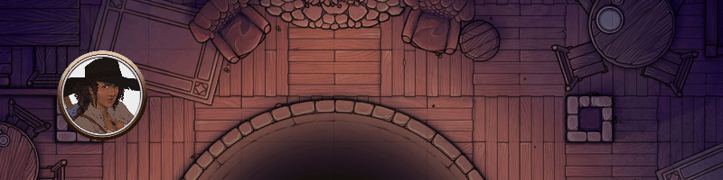
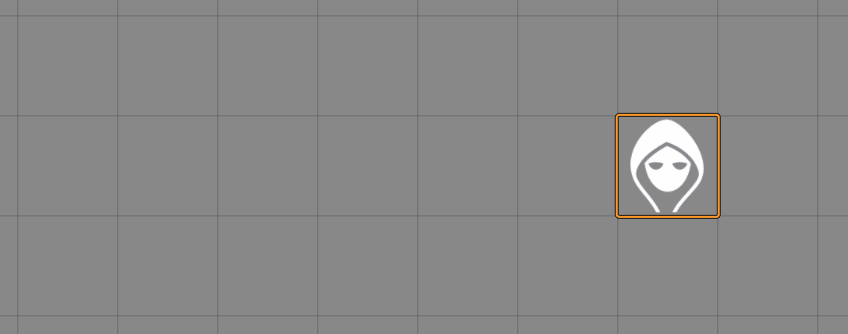

# Sequencer

This module implements a basic pipeline that can be used for managing the flow of a set of functions, effects, sounds, and macros.

The effects created by this module is completely synchronized across all clients thanks to the hard work of U~man over at [FXMaster](https://gitlab.com/mesfoliesludiques/foundryvtt-fxmaster).

## Download here:
`https://github.com/Haxxer/FoundryVTT-Sequencer/releases/latest/download/module.json`

## How to use

First you have to define a sequence:

```js
let sequence = new Sequence()
```

Then, you can add functions and effects to it.

```js
let sequence = new Sequence()

sequence.then(async function(){
    do_something();
})

sequence.wait(200)

sequence.then(async function(){
    do_something_else();
})
```

The Sequencer uses a method-chaining fluent interface, meaning you can continiously call functions on the sequence object, like so:

```js
let sequence = new Sequence()
    .then(async function(){
        do_something();
    })
    .wait(200)
    .then(async function(){
        do_something_else();
    })
```

To start the sequence off, you simply call `play()` on the sequence.

## Methods

### Then

`.then(() => {})`

This creates a function that will be called. Remember that if you want your function to be asynchronous and you want it to properly wait, you'll want to make the above:

`.then(async () => {})`

In addition, if you want your function to be `await`ed, you'll need to pass `true` as the last argument in the method call, like so:

`.then(async () => {}, true)`

### Macro

`.macro("MacroName")` or `.macro(macroReference)`

This will run a macro based on a name or a direct reference to a macro. If the macro is not found, Sequencer will complain. Loudly.

Similar to `.then()`, it's expected that you pass a boolean as a second parameter if you wish the Sequencer to wait for the macro to finish.

`.macro("New Macro", true)`

### Wait

`.wait(1000)`

Simple function, it makes the sequence wait after the last section for as many milliseconds as you pass to this method.

### Effect

`.effect()` or `.effect(inFile)`

Declares an effect to be played through FXMaster. Until you call `.then()`, `.effect()`, `.sound()`, or `.wait()`, you'll be working on the Effect object.

## Generic Methods

These methods can be called on any `.then` functions, effects, sounds, and macros.

### Wait Until Finished

`.async()` or `.async(true)`

Calling this method will cause the section to finish its execution before starting the next section.

You can also pass `true` to it for greater readability, but simply calling it will do.

`.waitUntilFinished()` or `.waitUntilFinished(true)`

Calling this method will cause the section to finish running before starting the next section.

**Note:** This differs from async in the sense that it will wait for *every* part of the effects or sounds to finish playing (including all of its repetitions, durations, delays, etc).

You can also pass `true` to it for greater readability, but simply calling it will do.

## Effect Methods

### Repeats

`.repeats(inRepetitions, inMinDelay, inMaxDelay)`

This will cause the effect to be repeated `inRepetitions` times, with an optional delay. This currently only functions on Effects and Sounds (under review).

As an option, you can give it `inMinDelay` for a static delay between repetitions, or `inMinDelay` and `inMaxDelay` for a random delay between each call.

It is highly recommended that you do not load too many Effect files at the same time, as Foundry might not be able to load all of them.

### Base folder

`.baseFolder(inPath)`

This defines the base folder that will prepended to the file path. This is mainly just useful to make the file path easier to manage.

### File

`.file(inPath)` or `.file(inArray)`

This declares which .webm to be played, but you can also do that when first initializing the effect.

This may also be an array of paths, which will be randomly picked from.

### At location

`.atLocation(token)` or `.atLocation({ x: 0, y: 0 })`

A smart method that can take a reference to a token, or a direct coordinate on the canvas to play the effect at.

### Aim towards

`.aimTowards(token)` or `.aimTowards({ x: 0, y: 0 })`

Another smart method (similar to above), which will cause the effect to be rotated towards the given token or coordinates.

### Moves

`.moves()` or `.moves(inBool)`

Calling this method will cause the effect to move towards `.aimTowards()` location. You can also pass `true` to it for greater readability, but simply calling it will do.

### Missed

`.missed()` or `.missed(inBool)`

Calling this method will cause the effect to target a location close to the `.aimTowards()` location, but not on it. You can also pass `true` to it for greater readability, but simply calling it will do.

### Add override

```js
.addOverride(async (effect, data) => {
    // Do things here
    return data;
})
```

This will directly modify the effect's data, which means you can manipulate which file will be used based on the distance to the target, etc.

`effect` is a reference to the effect in itself - interact with this at your own risk.

`data` is the effect's data that is going to be passed to FXMaster.

You _must_ define the function like above and return the data at the end of the function. See examples at the bottom of this readme for more in depth usage.

### Start point

`.startPoint(inNumber)`

This will define the start point within the given sprite, starting from the left of the sprite.

An example would be a given number of `200` - means that the sprite will consider 200 pixels into the sprite as the 'anchor point'.

### End point

`.endPoint(inNumber)`

The same as the start point, except from the right and how many pixels to offset the target from.

### Set mustache

`.setMustache(inObj)`

This will set the [Mustache](https://handlebarsjs.com/guide/) of the filepath. This is applied _after_ the randomization of the filepath, if available. 

See near the bottom of this document for examples.

### Scale

`.scale(0.5)` or `.scale({ x: 0.5, y: 1.0 })` or `.scale(0.2, 0.6)`

A method that can take the following:
- A number to set the scale uniformly
- An object with x and y for non-uniform scaling
- Two numbers which the Sequencer will randomly pick a uniform scale between

### Anchor

`.anchor({ x: 0.5, y: 0.5 })` or `.anchor(0.5)`

This will anchor the sprite according to the given x and y coordinates (or single number), effectively giving it an anchor of `{x: 0.5, y: 0.5}`.

### Center

`.center()`

This will center the sprite on the given location, effectively giving it an anchor of `{x: 0.5, y: 0.5}`.

**Note:** If this is used, it will override the anchor set by Aim Towards, which is to set the sprite on the outermost edge of the location of the location the sprite is played at.

### Random rotation

`.randomRotation()`

This will cause the sprite to have a random rotation, which means it should **not** be used with `.aimTowards()`.

**Note:** If this is used, it will override the anchor set by Aim Towards, which is to set the sprite on the outermost edge of the location of the location the sprite is played at.

### Delay

`.delay(1000)` or `.delay(500, 1000)`

This will delay the sprite from being played for a set amount of milliseconds. If given a second number, a random delay between the two numbers will be generated.

## Sound methods

`.sound()` or `.sound(inFile)`

Declares an sound to be played through the AudioHelper. Until you call `.then()`, `.effect()`, `.sound()`, or `.wait()`, you'll be working on the Effect object.

Sadly, sounds are not asynchronous, so this class cannot be `await`ed.

### Repeats

`.repeats(inRepetitions, inMinDelay, inMaxDelay)`

This will cause the sound to be repeated `inRepetitions` times, with an optional delay. This currently only functions on Effects and Sounds (under review).

As an option, you can give it `inMinDelay` for a static delay between repetitions, or `inMinDelay` and `inMaxDelay` for a random delay between each call.

### File

`.file(inPath)` or `.file(array)`

This declares which sound to be played, but you can also do that when first initializing the sound.

This may also be an array of paths, which will be randomly picked from.

### Volume

`.volume(inFloat)`

A normalized value between `0.0` and `1.0` which determines the volume of the sound. Defaults to `0.8`.

### Delay

`.delay(1000)` or `.delay(500, 1000)`

This will delay the sound from being played for a set amount of milliseconds. If given a second number, a random delay between the two numbers will be generated.

## Advanced examples

To get the following result:



You'd have to write something like this:

```js
async function wait(ms){
    return new Promise(resolve => {
        setTimeout(resolve, ms);
    });
}

const token = canvas.tokens.controlled[0];

let data = {
    file: "modules/animated-spell-effects-cartoon/spell-effects/cartoon/electricity/electrivity_blast_CIRCLE.webm",
    position: token.center,
    anchor: {
        x: 0.5,
        y: 0.5
    },
    scale: {
        x: 0.35,
        y: 0.35
    }
};

game.socket.emit("module.fxmaster", data);
canvas.fxmaster.playVideo(data);

await wait(400);

AudioHelper.play({
    src: ["Music/Sound_Effects/teleport.wav"],
    volume: 0.8,
    autoplay: true,
    loop: false
}, true);

await wait(600);

let to_location = {
    x: token.center.x-500,
    y: token.center.y
}

let ray = new Ray(token.center, this._to);

data = {
    file: "modules/animated-spell-effects-cartoon/spell-effects/cartoon/electricity/lightning_bolt_RECTANGLE_05.webm",
    position: token.center,
    anchor: {
        x: 0.5,
        y: 0.5
    },
    scale: {
        x: 0.2,
        y: 0.2
    },
    rotation: ray.angle,
    width: ray.distance
};

game.socket.emit("module.fxmaster", data);
canvas.fxmaster.playVideo(data);

await wait(100);

await token.update({ x: token.position.x-500, y: token.position.y }, { animate: false });

data = {
    file: "modules/animated-spell-effects-cartoon/spell-effects/cartoon/electricity/electric_ball_CIRCLE_06.webm",
    position: token.center,
    anchor: {
        x: 0.5,
        y: 0.5
    },
    scale: {
        x: 0.5,
        y: 0.5
    }
};

game.socket.emit("module.fxmaster", data);
canvas.fxmaster.playVideo(data);
```

Here's an example using the Sequencer instead:

* It plays an effect on a token's location
* Waits for 1 second
* Plays another effect pointing towards 500px to the left of the token
* Waits for 100 milliseconds
* Teleports the token 500px to the left
* Plays another effect on the token's location

```js
const token = canvas.tokens.controlled[0];
let sequence = new Sequence()
    .effect()
        .file("modules/animated-spell-effects-cartoon/spell-effects/cartoon/electricity/electrivity_blast_CIRCLE.webm")
        .atLocation(token)
        .scale(0.35)
    .wait(400)
    .sound("Music/Sound_Effects/teleport.wav").done()
    .wait(600)
    .effect()
        .file("modules/animated-spell-effects-cartoon/spell-effects/cartoon/electricity/lightning_bolt_RECTANGLE_05.webm")
        .atLocation(token)
        .aimTowards({
            x: token.center.x-500,
            y: token.center.y
        })
        .scale(0.2)
    .wait(100)
    .then(async function(){
        await token.update({ x: token.position.x-500, y: token.position.y }, { animate: false });
    })
    .effect()
        .file("modules/animated-spell-effects-cartoon/spell-effects/cartoon/electricity/electric_ball_CIRCLE_06.webm")
        .atLocation(token)
        .scale(0.5)

sequence.play();
```

## Magic Missile


```js
let sequence = new Sequence()
    .effect()
        .atLocation(canvas.tokens.controlled[0])
        .aimTowards(canvas.tokens.controlled[1])
        .startPoint(200)
        .endPoint(200)
        .repeats(3, 200, 300)
        .baseFolder("Images/Effects/Magic_Missile")
        .setMustache({
            "color": () => {
                return ['Blue', 'Green', 'Purple', 'Yellow'][Math.floor(Math.random() * 4)]
            },
            "number": () => {
                return Math.floor(Math.random() * 9) + 1;
            }
        })
        .addOverride(
            async (effect, data) => {
                if(data._distance <= 1800){
                    data.file = "MagicMissile_01_Regular_{{color}}_30ft_0{{number}}_1600x400.webm";
                }else{
                    data.file = "MagicMissile_01_Regular_{{color}}_60ft_0{{number}}_2800x400.webm";
                }
                return data
            }
        )
    .play();
```

## Changelog
*Coming soon*
