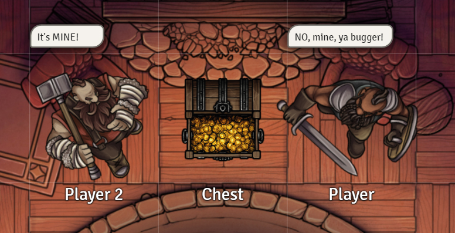

## What is Item Piles?

Have you ever wished you could represent items in your scenes? A pile of items, something to interact with - or perhaps
chests whose appearance changes depending on what happens to it, whether it's open, closed, full, or empty. Do you want
an easy way to split loot between players? Do you want easy to use merchants with great UIs?

Then you need **Item Piles**!

This module features:

* Dropping items on the canvas to create piles of items
* Item piles acting as containers with the ability to switch its token image depending on its open/closed/empty state,
  and play sounds accordingly
* Turn characters into fully featured merchants, with complex item pricing, item quantity management, and more
* Robust player-to-player trading features
* Incredibly intuitive API and documentation

Chest sprites used on this page is from Forgotten Adventures*

**not included in this module*

---

## Installation

It's always easiest to install modules from the in game add-on browser.

To install this module manually:

1. Inside the Foundry "Configuration and Setup" screen, click "Add-on Modules"
2. Click "Install Module"
3. In the "Manifest URL" field, paste the following url:
   `https://github.com/fantasycalendar/FoundryVTT-ItemPiles/releases/latest/download/module.json`
4. Click 'Install' and wait for installation to complete
5. Don't forget to enable the module in game using the "Manage Module" button

## [Changelog](https://github.com/fantasycalendar/FoundryVTT-ItemPiles/blob/master/changelog.md)

## Required Modules

### socketlib

This module uses the [socketlib](https://github.com/manuelVo/foundryvtt-socketlib/) library so that players can modify
the contents and the look of item piles without having to have full ownership of the item piles. Without it, they could
only drop items and create item piles using pile actors they own.

### libwrapper

This module uses the [libwrapper](https://github.com/ruipin/fvtt-lib-wrapper) library for wrapping core methods. It is a
hard dependency, and it is recommended for the best experience and compatibility with other modules.

## Optional Modules

### Advanced Macros

This module leverages the [Advanced Macros](https://github.com/League-of-Foundry-Developers/fvtt-advanced-macros) module
so that any macros can use extra data provided by the Item Piles module. This is an optional install, but highly
recommended.

## Requesting Support for System

Item Piles works in any system, but requires setup. If you wish to request native support for a system, please create a
new [system request here](https://github.com/fantasycalendar/FoundryVTT-ItemPiles/issues/new?assignees=Haxxer&labels=enhancement&template=system-request.md&title=%5BSYSTEM%5D+-+Write+the+system%27s+name+here)

Fill in _all_ of the information, and ask in the system's discord channel if you don't know what something means.

Incomplete requests will be rejected.

## Natively Supported Systems

Item Piles is designed to work in all systems, but may require some setup for it to fully function. Please refer to the
module settings to configure that.

- [Dungeons & Dragons 5e](https://foundryvtt.com/packages/dnd5e)
- [Pathfinder 1e](https://foundryvtt.com/packages/pf1)
- [Dungeon Slayers 4](https://foundryvtt.com/packages/ds4)
- [D&D 3.5e SRD](https://foundryvtt.com/packages/D35E)
- [Savage Worlds Adventure Edition](https://foundryvtt.com/packages/swade)
- [Tormenta20](https://foundryvtt.com/packages/tormenta20)
- [Warhammer Fantasy Roleplay 4th Ed](https://foundryvtt.com/packages/wfrp4e)
- [Splittermond](https://foundryvtt.com/packages/splittermond)
- [Starfinder](https://foundryvtt.com/packages/sfrpg)
- [Star Wars FFG](https://foundryvtt.com/packages/starwarsffg)
- [Index Card RPG](https://foundryvtt.com/packages/icrpg)
- [Forbidden Lands](https://foundryvtt.com/packages/forbidden-lands)
- [Fallout 2d20](https://foundryvtt.com/packages/fallout)

## Semi-supported systems

- [Pathfinder 2e](https://foundryvtt.com/packages/pf2e) - Major features for Item Piles does not work in this system, such as dropping items on scenes to create item piles, and dropping items on tokens to give it to them. Merchants and existing piles still work, but it is not a However, it is not strictly needed as PF2e already has a loot actor.

## Issues

Any issues, bugs, or feature requests are always welcome to be reported directly to
the [Issue Tracker](https://github.com/fantasycalendar/FoundryVTT-ItemPiles/issues), or using
the [Bug Reporter Module](https://foundryvtt.com/packages/bug-reporter/).

## License

This package is under an [MIT](LICENSE) and
the [Foundry Virtual Tabletop Limited License Agreement for module development](https://foundryvtt.com/article/license/)

## Credits

- Manuel Vögele for his "isResponsibleGM" function implementation and wonderful SocketLib module
- Otigon, Zhell, Gazkhan, and MrVauxs for their collective efforts surrounding macro evaluation and execution
- Forgotten Adventures for their amazing chest sprites (not included in the module)
- Caeora for their great maps and tokens (not included in this module)
