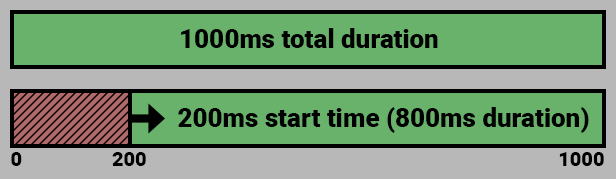
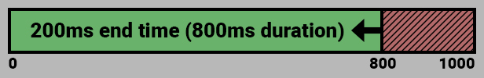
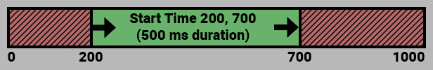

### What is this?
This part of the Sequencer makes playing sounds easy, including fading the sound in or out, playing for specific players, etc.

### How do I use this?

When creating a sound section, you can assemble these methods like this:
```js
new Sequence()
    .sound()
        .file("Music/Sound_Effects/Phoenix_Cry.wav")
        .fadeInAudio(500)
        .fadeOutAudio(500)
    .play()
```

<hr/>

## Wait Until Finished

`.waitUntilFinished()` or `.waitUntilFinished(-500)` or `.waitUntilFinished(0, 250)`

Calling this method will cause the sound to finish running before starting the next section.

Passing a number as a parameter will cause the sound or sound to wait for the given number (in ms) after finishing playing before continuing to the next section.

If given a negative number, the Sequencer will continue to the next section early but continue playing the sound.

Passing a second number will randomize the wait duration between the two given numbers.

## Async

`.async()`

Calling this will make each part of the sound finish playing before the next one starts playing.

This differs from `.waitUntilFinished()` in the sense that `.async()` is for each repetition (see `.repeats()` below), whilst `.waitUntilFinished()` is for the entire sound.

## Repeats

`.repeats(inRepetitions, inRepeatDelayMin, inRepeatDelayMax)`

Causes the sound or sound to be repeated `inRepetitions` times, with an optional delay.

As an option, you can give it `inRepeatDelayMin` for a static delay between repetitions, or `inRepeatDelayMin` and `inRepeatDelayMax` for a random delay between each call.

It is highly recommended that you do not load too many files at the same time, as Foundry might not be able to load all of them.

## Play if

`.playIf(truthy|falsey)` or `.playIf(inBool)` or `.playIf(inFunction)`

Causes the sound not play, and skip all delays, repetitions, waits, etc. If you pass a function, the function should return something false-y if you do not want the sound or sound to play.

Below is an example of a function used in this method, which would cause this sound or sound to only be played about 50% of the time.
```js
.playIf(() => {
	return Math.random() < 0.5;
})
```

## Delay

`.delay(1000)` or `.delay(500, 1000)`

This will delay the sound from being played for a set amount of milliseconds. If given a second number, a random delay between the two numbers will be generated.

## Preset

`.preset("name")`

Applies a preset to the current sound - read the [Sequencer Presets article](presets.md) for more information.

## Duration

`.duration(500)`

Sets the duration of the sound. If the duration is longer than the sound's original duration, it will loop.

## Volume

`.volume(0.5)`

A normalized value between `0.0` and `1.0` which determines the volume of the sound (if any). Defaults to `0.8`.

**Note:** This is affected by each client's volume settings in Foundry, so if you or your users cannot hear the sound, double check your Interface Volume.

## Fade In Audio

`.fadeInAudio(duration, options)`

`.fadeInAudio(500)` or `.fadeInAudio(250, {ease: "easeOutQuint"})` or `.fadeInAudio(400, {ease: "easeOutCirc", delay: 100})`

Causes the audio on the given sound fade in when played.

A second options parameter can set the ease of the fade, and the delay before it starts.

Default parameters: `{ ease: "linear", delay: 0 }`

Check out what easings are available here: https://easings.net/

## Fade Out Audio

`.fadeOutAudio(duration, options)`

`.fadeOutAudio(500)` or `.fadeOutAudio(250, {ease: "easeOutQuint"})` or `.fadeOutAudio(400, {ease: "easeOutCirc", delay: -100})`

Causes the sound to fade out its audio as it finishes playing.

A second options parameter can set the ease of the fade, and a delay before it ends. E.g. a delay of -500 means the fade will finish 500ms before the end.

Default parameters: `{ ease: "linear", delay: 0 }`

Check out what easings are available here: https://easings.net/

## Start Time

`.startTime(200)`

Sets the start time of the sound.

This causes the sound to skip ahead by an amount of milliseconds.



## Start Time Percentage

`.startTimePerc(0.25)`

Sets the start time of the sound based on a percentage from its total duration.

This also causes the sound to skip ahead, but instead based on the total duration of the sound, which is useful if you don't know the exact duration.


## End Time

`.endTime(200)`

Sets the ending time of the sound.

This causes the sound to skip ahead by an amount of milliseconds.



## End Time Percentage

`.endTimePerc(0.25)`

Sets the ending time of the sound based on a percentage from its total duration.

This also causes the sound to skip ahead, but instead based on the total duration of the sound, which is useful if you don't know the exact duration.


## Time Range

`.timeRange(200, 700)`

Sets the start and end time of the section, playing only that range.

Unlike `.endTime()`, the last parameter is the absolute end time, not the time from end of the duration.



## Locally

`.locally()` or `.locally(bool)`

Causes sound to be played only locally, and not push to other connected clients.

## For Users

`.forUsers(string)` or `.forUsers(array)`

Causes the sound to be played for only a set of users.

Accepts a single user ID or username (case-sensitive), or an array thereof.

## Base folder

`.baseFolder(inPath)`

Defines the base folder that will prepend to the file path. This is mainly just useful to make the file path easier to manage.

## File

```js
.file(inFilePath = string|array<string>)
```

- Filepath: `.file("Audio/Soundly_Assets/Combat/Blade/Miss1.wav")`
- Wildcard filepath: `.file("Audio/NeverWinter_Assets/Effects/Magic/Ice/*.wav")`
- Database Path: `.file("EffectAudioDB.Blade.hit")`

Declares which sound to be played, but you can also do that when first initializing the sound with `.sound("file/path/here.wav")`

This may also be an array of paths, which will be randomly picked from each time the sound is played.

If the path is a filepath, it may also contain a wildcard, which will cause the Sound to pick randomly between matching filepaths.

In addition, if the sound has been registered on the [Sequencer database](https://github.com/fantasycalendar/FoundryVTT-Sequencer/wiki/Sequencer-Database), you can reference database files with a dot-notation like so: `your_module_name.sounds.generic.explosions`

We recommend users and creators alike read the documentation on the [Sequencer database](https://github.com/fantasycalendar/FoundryVTT-Sequencer/wiki/Sequencer-Database).

## Add override

Adds a function that will run at the end of the sound serialization step, but before it is played. Allows direct modifications of sound's data. For example, it could be manipulated to change which file will be used based  on the distance to the target.

```js
.addOverride(async (sound, data) => {
    // Do things here
    return data;
})
```

`sound` is a reference to the sound in itself - interact with this at your own risk.

`data` is the sound's data that is going to be passed to canvas layer.

You _must_ define the function like above and return the data at the end of the function. See examples at the bottom of the [readme](https://github.com/fantasycalendar/FoundryVTT-Sequencer/blob/master/README.md#magic-missile) for more in depth usage.

## Set mustache

`.setMustache(inObj)`

Sets the [Mustache](https://handlebarsjs.com/guide/) of the filepath. This is applied _after_ the randomization of the filepath, if available.

An example would be to provide a path like this to the sound: `Explosion_{{type}}_{{number}}.wav`

By then calling this method and passing an object, Mustache will attempt to fill in `{{type}}` and `{{number}}` with that object. This means we can dynamically generate the string for the path. If you were to pass this into the method:

```js
{
    "type": "Electrical",
    "number": "5"
}
```

The final result would become: `Explosion_Electrical_5.wav`

You can also pass functions that will get evaluated during runtime by Mustache:

```js
{
    "color": () => {
        return ['Fire', 'Electrical', 'Underwater'][Math.floor(Math.random() * 3)] // Pick a random type from this list
    },
    "number": () => {
        return Math.floor(Math.random() * 9) + 1; // Pick between 1 and 9
    }
}
```

## At Location

### Only supported in Foundry v12

`.atLocation(object|string, object)`

Examples:
```js
.atLocation(token)
.atLocation({ x: 0, y: 0 })
.atLocation(token)
.atLocation(token, { randomOffset: true })
```

A smart method that can take:
- Reference to a token
- Reference to a template
- Direct coordinate on the canvas

Also supports a second options object that accepts:
- `randomOffset: number|boolean` - causes the location to be offset by a random amount - if given a number, this acts as a multiplier for the randomness, using the size of the object (or a single grid square/hex) as the multiplier.
- `offset: object` (default `{ x: 0, y: 0 }`) - causes the location to be offset by a set amount
- `gridUnits: boolean` - Used with `offset` to make each whole number represent in `x` and `y` to represent the sound's scene's grid size


## Radius

`.radius(inNumber)`

Examples:
```js
.radius(15)
```

Radius in number of feet (or other units) this sound will be played within. The distance is determined by the scene's Grid Scale.

**Note:** Requires `.atLocation()` to be called as well, or the sound will still be global.


## Constrained By Walls

`.constrainedByWalls(inBool)`

Examples:
```js
.constrainedByWalls(true)
.constrainedByWalls(false)
```

Whether the sound will be **completely** blocked by walls.

**Notes:**
- Defaults to `false`
- Requires `.atLocation()` to be called as well, or the sound will still be global.
- If set to `true`, `.muffledEffect()` (see below) will have no effect


## Distance Easing

`.distanceEasing(inBool)`

Examples:
```js
.distanceEasing(true)
.distanceEasing(false)
```

Whether the sound will have its volume eased by the distance from its origin.

**Notes:**
- Defaults to `true`
- Requires `.atLocation()` to be called as well, or the sound will still be global.

## SetAudioChannel

`.setAudioChannel(inString)`

Examples:
```js
.setAudioChannel("interface")
.setAudioChannel("environment")
```

Set the sound output channel.

**Notes:**
- Defaults to `interface`


## Always for GMs

`.alwaysForGMs(inBool)`

Examples:
```js
.alwaysForGMs(true)
.alwaysForGMs(false)
```

Whether the sound will play for GMs as if they were hearing it at the origin of the sound.

**Notes:**
- Defaults to `false`
- Requires `.atLocation()` to be called as well, or the sound will still be global.


## Base Effect

`.baseEffect(options)`

Examples:
```js
.baseEffect({ type: "lowpass", intensity: 4 })
```

An effect to be applied on the sound when it is heard as per normal, with no walls blocking the sound.

The options object this method accept can have the following two parameters:
- `type`: one of the effects in `CONFIG.soundEffects`, as of Foundry V12, this is:
  - `lowpass`
  - `highpass`
  - `reverb`
- `intensity`: how strong this type of effect will be

**Notes:**
- Requires `.atLocation()` to be called as well, as this is an effect only applicable to position-based sounds.


## Muffled Effect

`.muffledEffect(options)`

Examples:
```js
.muffledEffect({ type: "lowpass", intensity: 4 })
```

An effect to be applied on the sound when it is heard through a wall.

The options object this method accept can have the following two parameters:
- `type`: one of the effects in `CONFIG.soundEffects`, as of Foundry V12, this is:
  - `lowpass`
  - `highpass`
  - `reverb`
- `intensity`: how strong this type of effect will be

**Notes:**
- Requires `.atLocation()` to be called as well, as this is an effect only applicable to position-based sounds.
- Requires `.constrainedByWalls()` to be set to `false` (which is the default behavior).
