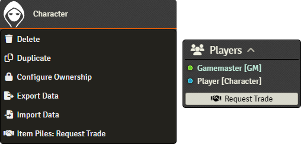
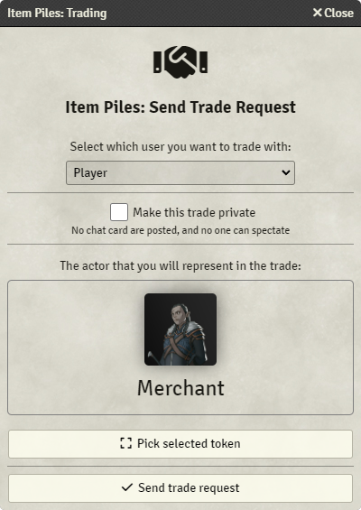
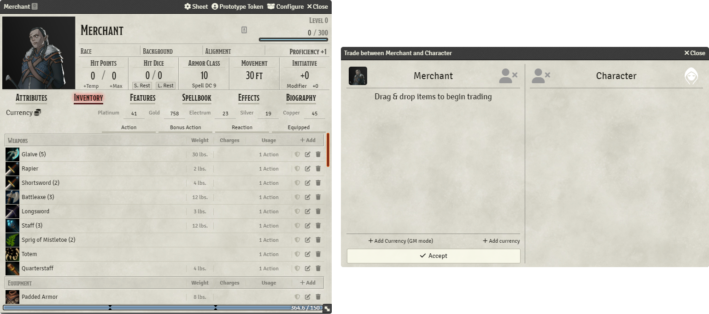
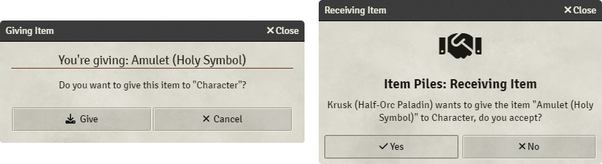

# Trading

When two or more users are logged into the Foundry session, the players are able to trade with each other. There are
multiple ways that they can go about this:

As a GM, you can right-click on a player owned actor in the right-hand actor sidebar to request a trade, and you can
open the trade request interface by clicking on the button in the bottom left-hand player list to request a trade.

## Request a trade

Once you have done this, you need to choose what character or token that will represent you in the trade. As a player,
it will select their main character (configured through their user profile in the bottom left-hand player list), but as
a GM, you need to choose an actor by dragging and dropping it, or by selecting a token and then clicking on the **Pick
Selected Token** button.

## Trading interface

Once the trade has been initiated, the two parties can offer up items by dragging and dropping them from their character
sheets and onto the trading interface. As currencies are not items, they have to be added by clicking **Add Currency**
on your half of the interface.

Adding a new item after the trade was approved by either party causes their agreement to be reset, as the outcome of the
trade changed.

## Quickly trading items

If you're only looking to give one item to another player's character, you can simply drag and drop onto the other
player's token, like as if you were dropping an item into a pile. This will prompt them to either accept or decline your
offer.

