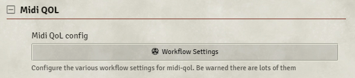
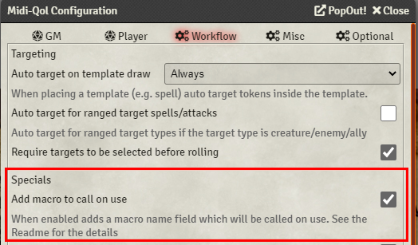
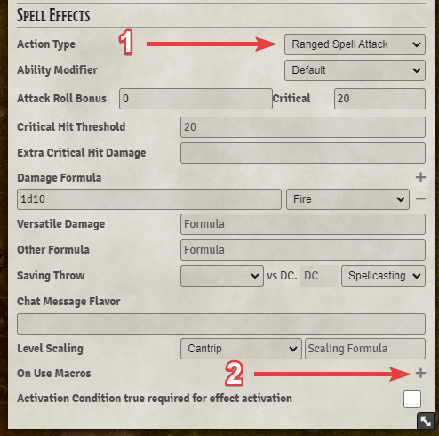
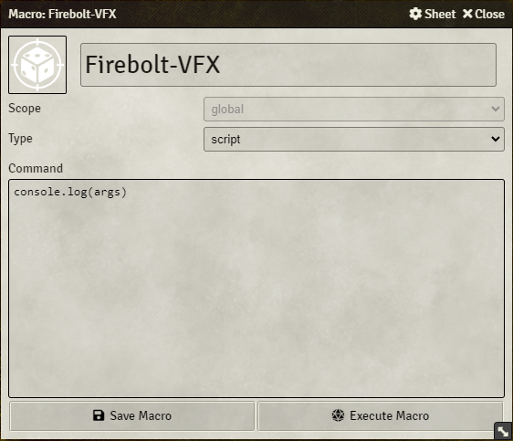

## End Result

With this guide, we'll be creating the following effect:


For this guide to work, you'll need the following modules installed:

- [Midi Quality of Life Improvements](https://foundryvtt.com/packages/midi-qol/)
- [Advanced Macros](https://foundryvtt.com/packages/advanced-macros)
- [JB2A - Jules & Ben's Animated Assets](https://foundryvtt.com/packages/JB2A_DnD5e)

## Initial setup

### Enable: `Midi QOL` ➜` Workflow Settings` ➜ `Workflow` ➜ `Add macro to call on use ☑️`️





# Macro Setup

## On Use Macro

Once you've enabled this, you'll need to make sure your Fire Bolt spell has the `Ranged Spell Attack` selected in its **Action Type** dropdown (1). When you've done that, you'll see that you have a **On Use Macros** at the bottom of the item details (2).



Click the **+** button to add a new input. Once you've done so, insert the name of your macro (case-sensitive) and select "After Attack Roll", and it will be called when the attack roll finishes, but before you roll damage.


Let's set up a Fire Bolt.

## Fire Bolt Item

Let's set up the Fire Bolt item itself. You can import it from the D&D 5e Spell Compendium, or set it up yourself. This is how mine is configured:


As you can see at the bottom, I've already put in the name of a macro called `Firebolt-VFX`, even though it doesn't exist yet.

Let's create that now!

## Fire Bolt Macro

Click on an empty space in the hotbar and create a new macro. First, let's start off by setting it to be a `Script`, and then add `console.log(args)` to the content.



When an item/spell/ability calls a macro through MidiQOL and Advanced Macros, it will send a bunch of useful information to the macro in the form of a variable called `args`.

With `args`, we can determine things like who called the macro, which item it was, what targets it had, and stuff like that. With the Sequencer, we can use all of that.

If you press F12, you'll open the console - this is where the `console` will `log` the message into, so we can see what MidiQOL has given us to work with.

## Deciphering the console

If you set up a quick test scene with the token who has the Firebolt spell and place another random token and target it, once you attack the target and damage/miss it, you can look in the console for something like this:


If you open it up, you'll see a whole lot more stuff:


As you can see, all of these are very useful to help us determine the who, what, when, and where!

## Creating The Macro

**Steps:**

1. [Determine the caster](#1-determine-the-caster)
2. [Start on the Sequence](#2-start-on-the-sequence)
3. [Add the Effect](#3-add-the-effect)
4. [Add the file path](#4-add-the-file-path)
5. [Choose the location](#5-choose-the-location)
6. [Determine the target](#6-determine-the-target)
7. [Setting up the effect to be able to miss](#7-setting-up-the-effect-to-be-able-to-miss)
8. [Play the effect](#8-play-the-effect)

<hr/>

### 1. Determine the caster

To get the token who used the item, you just need to:

```js
let tokenD = canvas.tokens.get(args[0].tokenId);
```

`args[0].tokenId` is the ID of the token that used the item, and we can get it from the canvas with `canvas.tokens.get`.

<hr/>

### 2. Start on the Sequence

Start by creating a new sequence:

```js
let tokenD = canvas.tokens.get(args[0].tokenId);

new Sequence();
```

<hr/>

### 3. Add the Effect

Then add an effect to it:

```js
let tokenD = canvas.tokens.get(args[0].tokenId);

new Sequence().effect();
```

<hr/>

### 4. Add the file path

Let's add the Fire Bolt path to the effect - your effect might be located somewhere else, so make sure the file exists:

```js
let tokenD = canvas.tokens.get(args[0].tokenId);

new Sequence()
  .effect()
  .file(
    "modules/JB2A_DnD5e-0.2.1/Library/Cantrip/Fire_Bolt/FireBolt_01_Regular_Orange_30ft_1600x400.webm"
  );
```

However, if you want to get fancy you can instead use the **Sequencer Database path** instead. You can get the Database Path to the firebolt by simply clicking on this button:


If you search for `fire_bolt` in that, you'll see this:


Simply click on the `Database` button, and you'll have copied the **Sequencer Database path** to the effect.

Paste that into the `.file()` section, so it looks like this:

```js
let tokenD = canvas.tokens.get(args[0].tokenId);

new Sequence().effect().file("jb2a.fire_bolt.orange");
```

<hr/>

### 5. Choose the location

Now, let's make it play from the token who used the item:

```js
let tokenD = canvas.tokens.get(args[0].tokenId);

new Sequence().effect().file("jb2a.fire_bolt.orange").atLocation(tokenD);
```

<hr/>

### 6. Determine the target

The target can be found in the `args` structure again, under `args[0].targets[0]`.

Then, let's make the effect **reach** towards the target:

```js
let tokenD = canvas.tokens.get(args[0].tokenId);

new Sequence()
  .effect()
  .file("jb2a.fire_bolt.orange")
  .atLocation(tokenD)
  .stretchTo(args[0].targets[0]);
```

(_Note:_ the reason why we're using `.stretchTo()` here is because JB2A's projectiles already move towards the target inside of the effect itself)

<hr/>

### 7. Setting up the effect to be able to miss

But what if the attack missed?! No worries, the Sequencer can handle that. Just add `.missed(args[0].hitTargets.length === 0)` to it.

What this means is that if there are tokens inside of `hitTargets` (as in, the attack DID hit something), it's false, meaning the effect _should_ hit the target.

But if there are no tokens in `hitTargets`, that means that the attack missed, so it will be true, meaning the effect will target a random square around the target.

```js
let tokenD = canvas.tokens.get(args[0].tokenId);

new Sequence()
  .effect()
  .file("jb2a.fire_bolt.orange")
  .atLocation(tokenD)
  .stretchTo(args[0].targets[0])
  .missed(args[0].hitTargets.length === 0);
```

<hr/>

### 8. Play the effect

Now, you just need to finish off with `.play()`!

```js
let tokenD = canvas.tokens.get(args[0].tokenId);

new Sequence()
  .effect()
  .file("jb2a.fire_bolt.orange")
  .atLocation(tokenD)
  .stretchTo(args[0].targets[0])
  .missed(args[0].hitTargets.length === 0)
  .play();
```

## Now target a token, cast the spell (DO NOT CLICK THE MACRO), and ta-da! You have a Fire Bolt!


