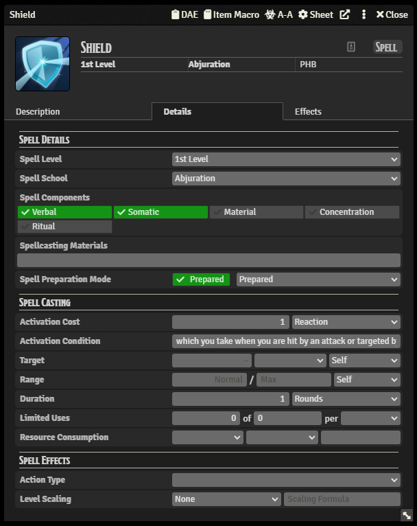

## End Result

With this guide, we'll be creating the following effect:


For this guide to work, you'll need the following modules installed:

- [Times Up](https://foundryvtt.com/packages/times-up/)
- [Dynamic Active Effects](https://foundryvtt.com/packages/dae)
- [Advanced Macros](https://foundryvtt.com/packages/advanced-macros)
- [JB2A - Jules & Ben's Animated Assets](https://foundryvtt.com/packages/JB2A_DnD5e)

## Shield Item & Effect

Let's set up the Shield spell itself, it's rather simple:



After you've set it up, let's set up the effect. These are the settings you need to have:


As you can see, the dynamic active effect ends at the end of the caster's next turn, and when it's cast and when it ends, a macro will be run, called `Shield-VFX`. Let's create that now!

## Macro

Similar to the [Fire Bolt tutorial](tutorials/advanced-fire-bolt.md), we'll be using the `args` parameter given to the macro by Advanced Macros. Read that tutorial to get an understanding of what that means.

**Steps:**

1. [If starting or ending](_#1-If-starting-or-ending)
2. [Determine the caster](_#2-Determine-the-caster)
3. [Start on the Sequence](_#3-Start-on-the-Sequence)
4. [Attach the effect to the caster](_#4-Attach-the-effect-to-the-caster)
5. [Scale and wait to finish](_#5-Scale-and-wait-to-finish)
6. [Create the looping effect](_#6-Create-the-looping-effect)
7. [Persist and name the looping effect](_#7-Persist-and-name-the-looping-effect)
8. [Fading in and out](_#8-Fading-in-and-out)
9. [Extra end duration and play](_#9-Extra-end-duration-and-play)
10. [End the looping effect](_#10-End-the-looping-effect)
11. [Play the outro](_#11-Play-the-outro)

<hr/>

### 1. If starting or ending

Since we're making an effect that can last for several rounds, Dynamic Active Effects changes the `args` a bit. If the effect lasts for a duration, `args[0]` can be `on` or `off`. "on" means the dynamic active effect just started and was applied to a target, and "off" means that the dynamic active effect ended on the target. With that in mind, we can start with this:

```js
if (args[0] === "on") {
  // If the dynamic active effect started
}

if (args[0] === "off") {
  // If the dynamic active effect ended
}
```

<hr/>

### 2. Determine the caster

To get the token who used the item, you just need to:

```js
let tokenD = canvas.tokens.get(args[1].tokenId);

if (args[0] === "on") {
  // If the dynamic active effect started
}

if (args[0] === "off") {
  // If the dynamic active effect ended
}
```

`args[1].tokenId` is the ID of the token that used the item, and we can get it from the canvas with `canvas.tokens.get`.

<hr/>

### 3. Start on the Sequence

Similar to the fire bolt we created before, we'll need to start by creating a new sequence, adding the effect, and the [database path](https://github.com/fantasycalendar/FoundryVTT-Sequencer/wiki/MidiQOL-&-JB2A-Fire-Bolt#4-add-the-file-path).

```js
let tokenD = canvas.tokens.get(args[1].tokenId);

if (args[0] === "on") {
  // If the dynamic active effect started
  new Sequence().effect().file("jb2a.shield.01.intro.blue");
}

if (args[0] === "off") {
  // If the dynamic active effect ended
}
```

<hr/>

### 4. Attach the effect to the caster

Then, all we need to do is attach the effect to the caster with `attachTo` - this will make the effect follow the token even if it moves around.

```js
let tokenD = canvas.tokens.get(args[1].tokenId);

if (args[0] === "on") {
  // If the dynamic active effect started
  new Sequence().effect().file("jb2a.shield.01.intro.blue").attachTo(tokenD);
}

if (args[0] === "off") {
  // If the dynamic active effect ended
}
```

<hr/>

### 5. Scale and wait to finish

The effect is a bit too big for the token, so I've also added `scale(0.5)`. In addition, since the effect we're playing is just the **intro**, we'll want to `waitUntilFinished`, as the next effect we're going to create is the **looping** shield effect.

```js
let tokenD = canvas.tokens.get(args[1].tokenId);

if (args[0] === "on") {
  // If the dynamic active effect started
  new Sequence()
    .effect()
    .file("jb2a.shield.01.intro.blue")
    .attachTo(tokenD)
    .scale(0.5)
    .waitUntilFinished(-500);
}

if (args[0] === "off") {
  // If the dynamic active effect ended
}
```

The -500 in `waitUntilFinished` just means that we're going to wait for the intro effect to finish playing, but move onto the next effect 500ms earlier. That's because the intro effect fades out, so we can't wait until its end or we're going to have a period in our effects where the shield is missing. Try it out by setting it to 0 once you're done.

<hr/>

### 6. Create the looping effect

As it is set up almost exactly the same as the previous effect - the only thing that changed is that the database file is instead `jb2a.shield.01.loop.blue`:

```js
let tokenD = canvas.tokens.get(args[1].tokenId);

if (args[0] === "on") {
  // If the dynamic active effect started
  new Sequence()
    .effect()
    .file("jb2a.shield.01.intro.blue")
    .attachTo(tokenD)
    .scale(0.5)
    .waitUntilFinished(-500)
    .effect()
    .file("jb2a.shield.01.loop.blue")
    .attachTo(tokenD)
    .scale(0.5);
}

if (args[0] === "off") {
  // If the dynamic active effect ended
}
```

<hr/>

### 7. Persist and name the looping effect

As we don't want the loop shield effect to end after it has finished one loop, we need to set it to `persist`, which basically means it lasts forever until we tell it to end. In order to easily do that, we can `name` the effect something unique, like `Shield` and the token's ID. Because of this we can easily find the effect down the line in order to end it:

```js
let tokenD = canvas.tokens.get(args[1].tokenId);

if (args[0] === "on") {
  // If the dynamic active effect started
  new Sequence()
    .effect()
    .file("jb2a.shield.01.intro.blue")
    .attachTo(tokenD)
    .scale(0.5)
    .waitUntilFinished(-500)
    .effect()
    .file("jb2a.shield.01.loop.blue")
    .attachTo(tokenD)
    .scale(0.5)
    .persist()
    .name(`Shield-${tokenD.id}`);
}

if (args[0] === "off") {
  // If the dynamic active effect ended
}
```

<hr/>

### 8. Fading in and out

Since the looping effect doesn't have a fade when it appears and disappears (because it is looping and can end at any point in the effect), we need to tell it to `fadeIn` and `fadeOut`. This just means that when the effect is first played, it will fade in its opacity, and when it ends, it will fade out its opacity. The number we give it is the duration of that fade:

```js
let tokenD = canvas.tokens.get(args[1].tokenId);

if (args[0] === "on") {
  // If the dynamic active effect started
  new Sequence()
    .effect()
    .file("jb2a.shield.01.intro.blue")
    .attachTo(tokenD)
    .scale(0.5)
    .waitUntilFinished(-500)
    .effect()
    .file("jb2a.shield.01.loop.blue")
    .attachTo(tokenD)
    .scale(0.5)
    .persist()
    .name(`Shield-${tokenD.id}`)
    .fadeIn(300)
    .fadeOut(300);
}

if (args[0] === "off") {
  // If the dynamic active effect ended
}
```

<hr/>

### 9. Extra end duration and play

Last, but not least, we need to give the loop effect `extraEndDuration`. That means that when the effect ends, the sequence will wait a bit longer before making the loop effect end. This gives us a bit more time to prepare for the effect disappearing when we want to play the **outro** effect (more on that later).

```js
let tokenD = canvas.tokens.get(args[1].tokenId);

if (args[0] === "on") {
  // If the dynamic active effect started
  new Sequence()
    .effect()
    .file("jb2a.shield.01.intro.blue")
    .attachTo(tokenD)
    .scale(0.5)
    .waitUntilFinished(-500)
    .effect()
    .file("jb2a.shield.01.loop.blue")
    .attachTo(tokenD)
    .scale(0.5)
    .persist()
    .name(`Shield-${tokenD.id}`)
    .fadeIn(300)
    .fadeOut(300)
    .extraEndDuration(800)
    .play();
}

if (args[0] === "off") {
  // If the dynamic active effect ended
}
```

<hr/>

### 10. End the looping effect

When the dynamic active effect ends, it will call the macro again, but set `args[0]` to `off`, meaning only the last part of the macro runs.

In this case, we can use the `Sequencer.EffectManager` to end the effect that is currently playing on the token:

```js
let tokenD = canvas.tokens.get(args[1].tokenId);

if (args[0] === "on") {
  // If the dynamic active effect started
  new Sequence()
    .effect()
    .file("jb2a.shield.01.intro.blue")
    .attachTo(tokenD)
    .scale(0.5)
    .waitUntilFinished(-500)
    .effect()
    .file("jb2a.shield.01.loop.blue")
    .attachTo(tokenD)
    .scale(0.5)
    .persist()
    .name(`Shield-${tokenD.id}`)
    .fadeIn(300)
    .fadeOut(300)
    .extraEndDuration(800)
    .play();
}

if (args[0] === "off") {
  // If the dynamic active effect ended
  Sequencer.EffectManager.endEffects({
    name: `Shield-${tokenD.id}`,
    object: tokenD,
  });
}
```

As you can see, we tell it to end the effect with the `name` of `Shield-${tokenD.id}` (which we set before) on the `tokenD`. This means we are 100% sure we're ending the right effect!

<hr/>

### 11. Play the outro

By this point, you should be able to understand how the Sequence and effects fit together, so I'll just show you what it looks like:

```js
let tokenD = canvas.tokens.get(args[1].tokenId);

if (args[0] === "on") {
  // If the dynamic active effect started
  new Sequence()
    .effect()
    .file("jb2a.shield.01.intro.blue")
    .attachTo(tokenD)
    .scale(0.5)
    .waitUntilFinished(-500)
    .effect()
    .file("jb2a.shield.01.loop.blue")
    .attachTo(tokenD)
    .scale(0.5)
    .persist()
    .name(`Shield-${tokenD.id}`)
    .fadeIn(300)
    .fadeOut(300)
    .extraEndDuration(800)
    .play();
}

if (args[0] === "off") {
  // If the dynamic active effect ended
  Sequencer.EffectManager.endEffects({
    name: `Shield-${tokenD.id}`,
    object: tokenD,
  });

  new Sequence()
    .effect()
    .file("jb2a.shield.01.outro_explode.blue")
    .scale(0.5)
    .attachTo(tokenD)
    .play();
}
```

## Now cast the spell (DO NOT CLICK THE MACRO), and ta-da! You have Shield!


