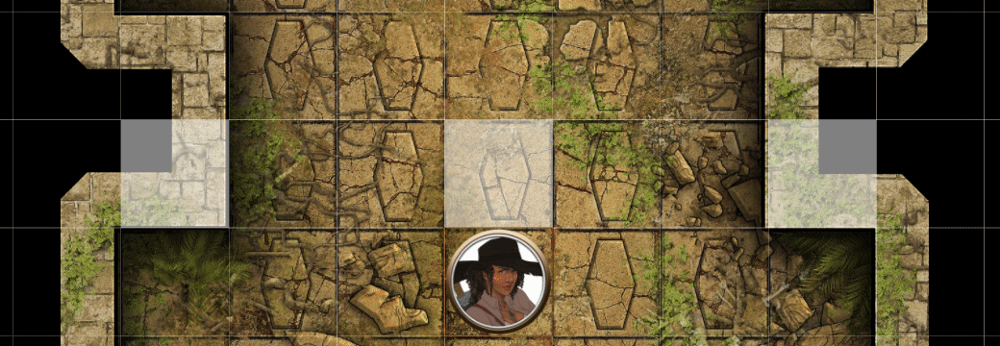
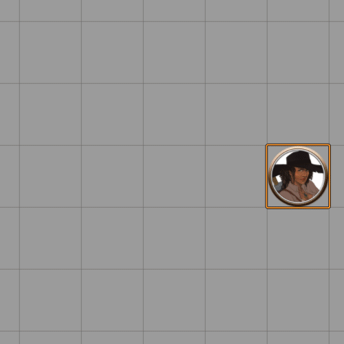
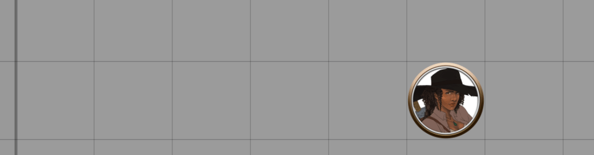
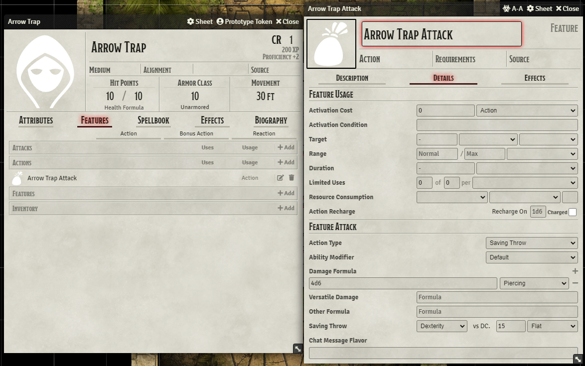
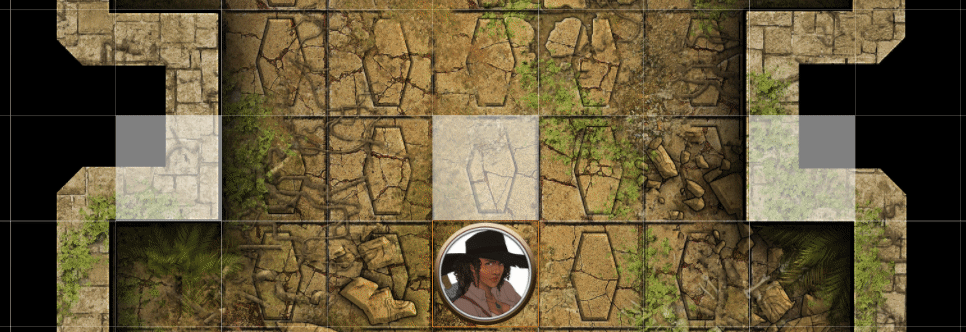

This guide will have two parts, one simple trap, and one more complex. The complex part will assume you know a bit more about macros, but you should still be able to follow along.

We're going to rely primarily on Monk's Active Tiles to trigger macros, which will use Sequencer to play effects from JB2A's asset pack on specific locations and tokens.

In the advanced macro, we'll add more complex behavior such as arrows shooting from a different location and dealing damage to the token. We'll achieve this with Tagger's powerful functions alongside MidiQOL.

_[Click here to go to the advanced macro](#advanced-macro)_



<hr/>

# Simple Macro

## Simple macro end result



### Required modules
* [Sequencer](https://foundryvtt.com/packages/sequencer)
* [Monk's Active Tile Triggers](https://foundryvtt.com/packages/monks-active-tiles)
* [JB2A - Jules & Ben's Animated Assets](https://foundryvtt.com/packages/JB2A_DnD5e) (or the patreon version)

**Steps:**
1. [Create a new macro](#1-create-a-new-macro)
2. [Add test line to Macro](#2-add-test-line-to-Macro)
3. [Add a new tile and hide it](#3-add-a-new-tile-and-hide-it)
4. [Configure the trap trigger](#4-configure-the-trap-trigger)
5. [Try it out!](#5-try-it-out!)
6. [Adding effects](#6-adding-effects)
7. [Tweaking the trigger](#7-tweaking-the-trigger)
8. [Simple macro final result](#8-simple-macro-final-result)

<hr/>

### 1. Create a new macro

Create a new macro and call it something specific and unique, like `Callback-Fire-Trap`. This means that there's little chance you'll confuse what macro it is.

<hr/>

### 2. Add test line to Macro

Set the macro type to "script", and add this line to the macro:

```js
ui.notifications.notify(token.name + " stepped on the trap!");
```

This means that when you run this macro, it will push a notification in Foundry with the token's name.

<hr/>

### 3. Add a new tile and hide it

Use the tile tool to create a new empty tile on a square, then right click on it and hide it by clicking on the `Toggle Visibility State`. It's still visible for you as a GM, but for players it will be invisible.


<hr/>

### 4. Configure the trap trigger

In the "Triggers" menu, set the trigger to **active**, and then add a new action with the "Run Macro" action, using the macro "Callback-Fire-Trap" macro.


<hr/>

### 5. Try it out!

Now when you move a token over the tile, the tile will react to the token entering its space, and run the macro!



<hr/>

### 6. Adding effects

Now that we've made a macro trigger when a token steps into the tile's space, let's add an explosion to play on its space.

Replace the contents of the `Callback-Fire-Trap` macro with the following:

```js
new Sequence()
    .effect()
        .file("modules/jb2a_patreon/Library/Generic/Explosion/Explosion_01_Orange_400x400.webm")
        .atLocation(token)
    .play()
```

As you can see, the macro will start a `new Sequence()`, which will play an `.effect()` with a `.file()`, but `.atLocation()` determined by who triggered it, the **token**, and then we immediately `.play()` it!


But, as you can see. Because the tile triggers as soon as the token **enters** the tile, the token hasn't finished moving before the macro runs. That's easily tweaked!

<hr/>

### 7. Tweaking the trigger

Edit the tile and go to its triggers again, delete the action you created before. Add a new one, and set it to `Stop Token Movement`, and turn on `Snap To Grid`. Then, create the same trigger as you had before, but set the `After 0 seconds` field to `0.1` seconds instead.


<hr/>

### 8. Simple macro final result

Now, as you can see, when the tile is triggered, the tile stops the token from moving any further, then it waits for 0.1 seconds (100ms) before triggering the macro. The macro then runs a Sequence that creates an effect on the token's location.


<hr/>

# Advanced Macro

## Advanced macro end result


### Required Modules
* [Sequencer](https://foundryvtt.com/packages/sequencer)
* [Monk's Active Tile Triggers](https://foundryvtt.com/packages/monks-active-tiles)
* [JB2A - Jules & Ben's Animated Assets](https://foundryvtt.com/packages/JB2A_DnD5e) (or the patreon version)
* [Tagger](https://foundryvtt.com/packages/tagger)
* [Midi Quality of Life Improvements](https://foundryvtt.com/packages/midi-qol)

**Steps:**
1. [Create three hidden tiles and tag them](#1-Create-three-hidden-tiles-and-tag-them)
2. [Set up the triggers](#2-Set-up-the-triggers)
3. [Create Trap Actor](#3-Create-Trap-Actor)
4. [Macro: Get the trap actor and trap item](#4-Macro-Get-the-trap-actor-and-trap-item)
5. [Macro: Deal some damage with MidiQOL](#5-Macro-Deal-some-damage-with-MidiQOL)
6. [Macro: Set up MidiQOL's hook](#6-Macro-Set-up-MidiQOLs-hook)
7. [Macro: Get the tiles](#7-Macro-Get-the-tiles)
8. [Macro: Spawn effect from left to right, and right to left](#8-Macro-Spawn-effect-from-left-to-right,-and-right-to-left)
9. [Macro: Make arrows hit the token if they failed their save](#9-Macro-Make-arrows-hit-the-token-if-they-failed-their-save)
10. [Advanced macro final result](#10-Advanced-macro-final-result)

<hr/>

### 1. Create three hidden tiles and tag them

I've switched maps in this tutorial to make something a bit more complex. With Tagger, you can add tags to objects on the canvas, and quite easily get those with a few simple commands. Create three tiles, make them hidden like before, and add these tags to the two tiles on the walls, respectively:

- `left-trap-source`
- `right-trap-source`

Like this:


Put your left and right tiles in the walls, that way the effect will look like it's coming out of the walls.

<hr/>

### 2. Set up the triggers

Set up your trap tile's triggers the same way as the previous tutorial, but only do it on the one you added the triggers to and nothing else. We're going to use the other two to create effects on them.

Don't forget to hide all of them, too. Otherwise your traps are going to be very obvious!

<hr/>

### 3. Create Trap Actor

Set up an actor with an item with a saving throw and damage roll:



<hr/>

### 4. Macro: Get the trap actor and trap item

Create a macro called `Callback-Arrow-Trap`, and in the macro you can retrieve the trap actor's item with:

```js
const trapActor = game.actors.getName("Arrow Trap");
const trapItem = trapActor.items.getName("Arrow Trap Attack");
```

<hr/>

### 5. Macro: Deal some damage with MidiQOL

Now we just need to use the trap workflow that comes with MidiQOL. If you want to try it out, select a random token and run the macro

```js
const trapActor = game.actors.getName("Arrow Trap");
const trapItem = trapActor.items.getName("Arrow Trap Attack");

new MidiQOL.TrapWorkflow(trapActor, trapItem, [token]);
```

<hr/>

### 6. Macro: Set up MidiQOL's hook

MidiQOL is quite complex and it can resolve saving throws and damage rolls in many different ways that is quite hard to anticipate. The best way to ensure that something happens _after_ MidiQOL is done damaging the token that triggered the trap is to use MidiQOL's hooks.

When MidiQOL is finished, it fires off what is called a "hook", which is Foundry's preferred way to handle events. Simply add this:

```js
const trapActor = game.actors.getName("Arrow Trap");
const trapItem = trapActor.items.getName("Arrow Trap Attack");

new MidiQOL.TrapWorkflow(trapActor, trapItem, [token]);

Hooks.once("midi-qol.RollComplete", async function(result){
    
});
```

Once the `TrapWorkflow` is finished, the function inside the `midi-qol.RollComplete` hook will run, with the `result` of the trap's attack and saving throw available to us.

<hr/>

### 7. Macro: Get the tiles

Now with trap's attack and damage is sorted, we're going to get the tiles that we need with `Tagger.getByTag()`:

```js
const trapActor = game.actors.getName("Arrow Trap");
const trapItem = trapActor.items.getName("Arrow Trap Attack");

new MidiQOL.TrapWorkflow(trapActor, trapItem, [token]);

Hooks.once("midi-qol.RollComplete", async function(result){
    
    const [leftTile] = await Tagger.getByTag('left-trap-source');
    const [rightTile] = await Tagger.getByTag('right-trap-source');

});
```

This way we can retrieve those tiles without having to memorize their IDs, or loop through the tiles on the canvas, Tagger does the heavy lifting for you. `getByTag` returns an array, so you just get the first element in that array by assigning it directly into an array.

<hr/>

### 8. Macro: Spawn effect from left to right, and right to left

Now with this macro, let's write a Sequence:

```js
const trapActor = game.actors.getName("Arrow Trap");
const trapItem = trapActor.items.getName("Arrow Trap Attack");

new MidiQOL.TrapWorkflow(trapActor, trapItem, [token]);

Hooks.once("midi-qol.RollComplete", async function(result) {

    const [leftTile] = await Tagger.getByTag('left-trap-source');
    const [rightTile] = await Tagger.getByTag('right-trap-source');

    new Sequence()
        .effect()
            .file("jb2a.arrow.physical.white.01")
            .atLocation(leftTile)
            .stretchTo(rightTile)
            .randomOffset()
            .repeats(5, 30, 60)
        .effect()
            .file("jb2a.arrow.physical.white.01")
            .atLocation(rightTile)
            .stretchTo(leftTile)
            .randomOffset()
            .repeats(5, 30, 60)
        .play();

});
```

As you can see, we're playing two `.effect()`s, both of the them are using the JB2A white arrow `.file()` in the Sequencer Database. These are being spawned at the left tile and attacking the right tile, and vice versa, but also targeting a random space within the opposite tile with `.randomOffset()`. Each side `.repeats()` 5 times, with a random delay between 30 and 60 milliseconds.




### 9. Macro: Make arrows hit the token if they failed their save

So, if the target failed their save, we want to pepper them full of arrows, and if they succeeded on their save, the arrows can fly past.

We can achieve this by switching out the object we give to the `.reachTowards()` method. Right before the `new Sequence()`, we can put this piece of code:

```js
const leftTarget = result.failedSaves.has(token) ? token : leftTile;
const rightTarget = result.failedSaves.has(token) ? token : rightTile;
```

What this means if that MidiQOL's trap workflow determines that the actor who triggered the trap failed the save, we set `leftTarget` and `rightTarget` to use the token. If they succeeded, we instead set them to `leftTile` and `rightTile`, respectively.

Then you just need to switch those in the `.reachTowards()`, and this is how the final macro looks like this now:

```js
const trapActor = game.actors.getName("Arrow Trap");
const trapItem = trapActor.items.getName("Arrow Trap Attack");

new MidiQOL.TrapWorkflow(trapActor, trapItem, [token]);

Hooks.once("midi-qol.RollComplete", async function(result) {

    const [leftTile] = await Tagger.getByTag('left-trap-source');
    const [rightTile] = await Tagger.getByTag('right-trap-source');

    const leftTarget = result.failedSaves.has(token) ? token : leftTile;
    const rightTarget = result.failedSaves.has(token) ? token : rightTile;

    new Sequence()
        .effect()
            .file("jb2a.arrow.physical.white.01")
            .atLocation(leftTile)
            .stretchTo(rightTarget) // <----------------------- Right here
            .randomOffset()
            .repeats(5, 30, 60)
        .effect()
            .file("jb2a.arrow.physical.white.01")
            .atLocation(rightTile)
            .stretchTo(leftTarget) // <---------------------- and right here
            .randomOffset()
            .repeats(5, 30, 60)
        .play();
});
```

### 10. Advanced macro final result


