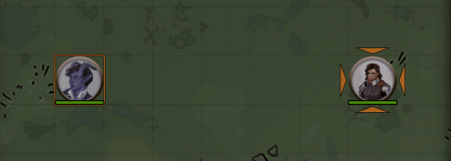
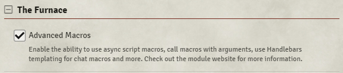
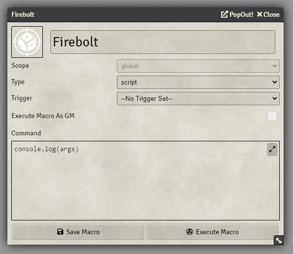
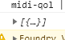
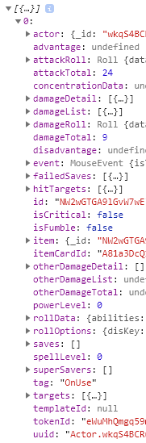

<<<<<<< HEAD
# How to use the Sequencer in 5E macros

With this guide, we'll be creating the following effect:



For this guide to work, you'll need the following modules installed:
* [Midi Quality of Life Improvements](https://foundryvtt.com/packages/midi-qol/)
* [Advanced Macros](https://foundryvtt.com/packages/advanced-macros) (or [The Furnace](https://foundryvtt.com/packages/furnace) if you're on 0.7.x with Advanced Macros enabled)
* [JB2A - Jules & Ben's Animated Assets](https://foundryvtt.com/packages/JB2A_DnD5e)

## Initial setup

### Enable: `Midi QOL` ➜` Workflow Settings` ➜ `Workflow` ➜ `Add macro to call on use ☑️`️
   


### 0.7.x only - If you have The Furnace installed, enable `Advanced Macros ☑️`:



# Macro Setup

## On Use Macro

When you've set this up, you'll see that each item will have a `On Use Macro` section at the bottom of the item.

The item has to have an **Action Type** for this to visible.


When you insert the name of a macro (case-sensitive), it will be called when the item finishes its action. Let's set up a Fire Bolt.

## Fire Bolt Item

Let's set up the Fire Bolt item itself. Just fill in these details, like you would with a normal spell:


As you can see at the bottom, I've already put in the name of a macro called `Firebolt`, even though it doesn't exist yet.

Let's create that now!

## Fire Bolt Macro

Click on an empty space in the hotbar and create a new macro. First, let's start off by setting it to be a `Script`, and then add `console.log(args)` to the content.



When an item/spell/ability calls a macro through MidiQOL and Advanced Macros, it will send a bunch of useful information to the macro in the form of a variable called `args`.

With `args`, we can determine things like who called the macro, which item it was, what targets it had, and stuff like that. With the Sequencer, we can use all of that.

If you press F12, you'll open the console - this is where the `console` will `log` the message into, so we can see what MidiQOL has given us to work with.

## Deciphering the console

If you set up a quick test scene with the token who has the Firebolt spell and place another random token and target it, once you attack the target and damage/miss it, you can look in the console for something like this:



If you open it up, you'll see a whole lot more stuff:



As you can see, all of these are very useful to help us determine the who, what, when, and where!

## Using the args

### The caster

To get the token who used the item, you just need to:

```js
let tokenD = canvas.tokens.get(args[0].tokenId);
```

`args[0].tokenId` is the ID of the token that used the item, and we can get it from the canvas with `canvas.tokens.get`.

### The target

The token that is the target of the item is found through `args[0].targets[0]`.

### The Sequence

So, we've got the two parts to our macro that we need to play an effect between them, so let's make that happen.

First, start by creating a new sequence:

```js
let tokenD = canvas.tokens.get(args[0].tokenId);

new Sequence()
```

<hr/>

Then add an effect to it:

```js
let tokenD = canvas.tokens.get(args[0].tokenId);

new Sequence()
    .effect()
```

<hr/>

Let's add the Fire Bolt filepath to the effect - your effect might be located somewhere else, so make sure the file exists:

```js
let tokenD = canvas.tokens.get(args[0].tokenId);

new Sequence()
    .effect()
        .file("modules/JB2A_DnD5e-0.2.1/Library/Cantrip/FireBolt_01_Regular_Orange_30ft_1600x400.webm")
```

<hr/>

Now, let's make it play from the token who used the item:

```js
let tokenD = canvas.tokens.get(args[0].tokenId);

new Sequence()
    .effect()
        .file("modules/JB2A_DnD5e-0.2.1/Library/Cantrip/FireBolt_01_Regular_Orange_30ft_1600x400.webm")
        .atLocation(tokenD)
```

<hr/>

Then, let's make the effect **reach** towards the target:

(*Note:* the reason why we're using reach towards here is because JB2A's projectiles already move towards the target inside the animation itself)

```js
let tokenD = canvas.tokens.get(args[0].tokenId);

new Sequence()
    .effect()
        .file("modules/JB2A_DnD5e-0.2.1/Library/Cantrip/FireBolt_01_Regular_Orange_30ft_1600x400.webm")
        .atLocation(tokenD)
        .reachTowards(args[0].targets[0])
```

<hr/>

JB2A has specific margins and padding on their effects, but the Sequencer has direct support for that, so just add `.JB2A()` to the macro:

```js
let tokenD = canvas.tokens.get(args[0].tokenId);

new Sequence()
    .effect()
        .file("modules/JB2A_DnD5e-0.2.1/Library/Cantrip/FireBolt_01_Regular_Orange_30ft_1600x400.webm")
        .atLocation(tokenD)
        .reachTowards(args[0].targets[0])
        .JB2A()
```

<hr/>

But what if the attack missed?! No worries, the Sequencer can handle that. Just add `.missed(args[0].hitTargets.length === 0)` to it.

What this means is that if there are tokens inside of `hitTargets` (as in, the attack DID hit something), it's false, meaning the effect *should* hit the target.

But if there are no tokens in `hitTargets`, that means that the attack missed, so it will be true, meaning the effect will target a random square around the target.

```js
let tokenD = canvas.tokens.get(args[0].tokenId);

new Sequence()
    .effect()
        .file("modules/JB2A_DnD5e-0.2.1/Library/Cantrip/FireBolt_01_Regular_Orange_30ft_1600x400.webm")
        .atLocation(tokenD)
        .reachTowards(args[0].targets[0])
        .JB2A()
        .missed(args[0].hitTargets.length === 0)
```

<hr/>

Now, you just need to finish off with `.play()`!

```js
let tokenD = canvas.tokens.get(args[0].tokenId);

new Sequence()
    .effect()
        .file("modules/JB2A_DnD5e-0.2.1/Library/Cantrip/FireBolt_01_Regular_Orange_30ft_1600x400.webm")
        .atLocation(tokenD)
        .reachTowards(args[0].targets[0])
        .JB2A()
        .missed(args[0].hitTargets.length === 0)
    .play()
```

Now target a token, attack it, and ta-da! You have a Fire Bolt!


=======
# How to use the Sequencer in 5E macros

With this guide, we'll be creating the following effect:


For this guide to work, you'll need the following modules installed:
* [Midi Quality of Life Improvements](https://foundryvtt.com/packages/midi-qol/)
* [Advanced Macros](https://foundryvtt.com/packages/advanced-macros) (or [The Furnace](https://foundryvtt.com/packages/furnace) if you're on 0.7.x with Advanced Macros enabled)
* [JB2A - Jules & Ben's Animated Assets](https://foundryvtt.com/packages/JB2A_DnD5e)

## Initial setup

### Enable: `Midi QOL` ➜` Workflow Settings` ➜ `Workflow` ➜ `Add macro to call on use ☑️`️
   


### 0.7.x only - Enable `Advanced Macros ☑️` under The Furnace:


# Macro Setup

## On Use Macro

When you've set this up, you'll see that each item will have a `On Use Macro` section at the bottom of the item.

The item has to have an **Action Type** for this to visible.


When you insert the name of a macro (case-sensitive), it will be called when the item finishes its action. Let's set up a Fire Bolt.

## Fire Bolt Item

Let's set up the Fire Bolt item itself. Just fill in these details, like you would with a normal spell:


As you can see at the bottom, I've already put in the name of a macro called `Firebolt`, even though it doesn't exist yet.

Let's create that now!

## Fire Bolt Macro

Click on an empty space in the hotbar and create a new macro. First, let's start off by setting it to be a `Script`, and then add `console.log(args)` to the content.


When an item/spell/ability calls a macro through MidiQOL and Advanced Macros, it will send a bunch of useful information to the macro in the form of a variable called `args`.

With `args`, we can determine things like who called the macro, which item it was, what targets it had, and stuff like that. With the Sequencer, we can use all of that.

If you press F12, you'll open the console - this is where the `console` will `log` the message into, so we can see what MidiQOL has given us to work with.

## Deciphering the console

If you set up a quick test scene with the token who has the Firebolt spell and place another random token and target it, once you attack the target and damage/miss it, you can look in the console for something like this:


If you open it up, you'll see a whole lot more stuff:


As you can see, all of these are very useful to help us determine the who, what, when, and where!

## Using the args

### The caster

To get the token who used the item, you just need to:

```js
let tokenD = canvas.tokens.get(args[0].tokenId);
```

`args[0].tokenId` is the ID of the token that used the item, and we can get it from the canvas with `canvas.tokens.get`.

### The target

The token that is the target of the item is found through `args[0].targets[0]`.

### The Sequence

So, we've got the two parts to our macro that we need to play an effect between them, so let's make that happen.

First, start by creating a new sequence:

```js
let tokenD = canvas.tokens.get(args[0].tokenId);

new Sequence()
```

<hr/>

Then add an effect to it:

```js
let tokenD = canvas.tokens.get(args[0].tokenId);

new Sequence()
    .effect()
```

<hr/>

Let's add the Fire Bolt filepath to the effect - your effect might be located somewhere else, so make sure the file exists:

```js
let tokenD = canvas.tokens.get(args[0].tokenId);

new Sequence()
    .effect()
        .file("modules/JB2A_DnD5e-0.2.1/Library/Cantrip/FireBolt_01_Regular_Orange_30ft_1600x400.webm")
```

<hr/>

Now, let's make it play from the token who used the item:

```js
let tokenD = canvas.tokens.get(args[0].tokenId);

new Sequence()
    .effect()
        .file("modules/JB2A_DnD5e-0.2.1/Library/Cantrip/FireBolt_01_Regular_Orange_30ft_1600x400.webm")
        .atLocation(tokenD)
```

<hr/>

Then, let's make the effect **reach** towards the target:

(*Note:* the reason why we're using reach towards here is because JB2A's projectiles already move towards the target inside the animation itself)

```js
let tokenD = canvas.tokens.get(args[0].tokenId);

new Sequence()
    .effect()
        .file("modules/JB2A_DnD5e-0.2.1/Library/Cantrip/FireBolt_01_Regular_Orange_30ft_1600x400.webm")
        .atLocation(tokenD)
        .reachTowards(args[0].targets[0])
```

<hr/>

JB2A has specific margins and padding on their effects, but the Sequencer has direct support for that, so just add the following:

```js
let tokenD = canvas.tokens.get(args[0].tokenId);

new Sequence()
    .effect()
        .file("modules/JB2A_DnD5e-0.2.1/Library/Cantrip/FireBolt_01_Regular_Orange_30ft_1600x400.webm")
        .atLocation(tokenD)
        .reachTowards(args[0].targets[0])
        .JB2A()
```

<hr/>

But what if the attack missed?! No worries, the Sequencer can handle that. Just add `.missed(args[0].hitTargets.length === 0)` to it.

What this means is that if there are tokens inside of `hitTargets` (as in, the attack DID hit something), it's false, meaning the effect *should* hit the target.

But if there are no tokens in `hitTargets`, that means that the attack missed, so it will be true, meaning the effect will target a random square around the target.

```js
let tokenD = canvas.tokens.get(args[0].tokenId);

new Sequence()
    .effect()
        .file("modules/JB2A_DnD5e-0.2.1/Library/Cantrip/FireBolt_01_Regular_Orange_30ft_1600x400.webm")
        .atLocation(tokenD)
        .reachTowards(args[0].targets[0])
        .JB2A()
        .missed(args[0].hitTargets.length === 0)
```

<hr/>

Now, you just need to finish off with `.play()`!

```js
let tokenD = canvas.tokens.get(args[0].tokenId);

new Sequence()
    .effect()
        .file("modules/JB2A_DnD5e-0.2.1/Library/Cantrip/FireBolt_01_Regular_Orange_30ft_1600x400.webm")
        .atLocation(tokenD)
        .reachTowards(args[0].targets[0])
        .JB2A()
        .missed(args[0].hitTargets.length === 0)
    .play()
```

Now target a token, attack it, and ta-da! You have a Fire Bolt!


>>>>>>> a43f841 (Rewording)
